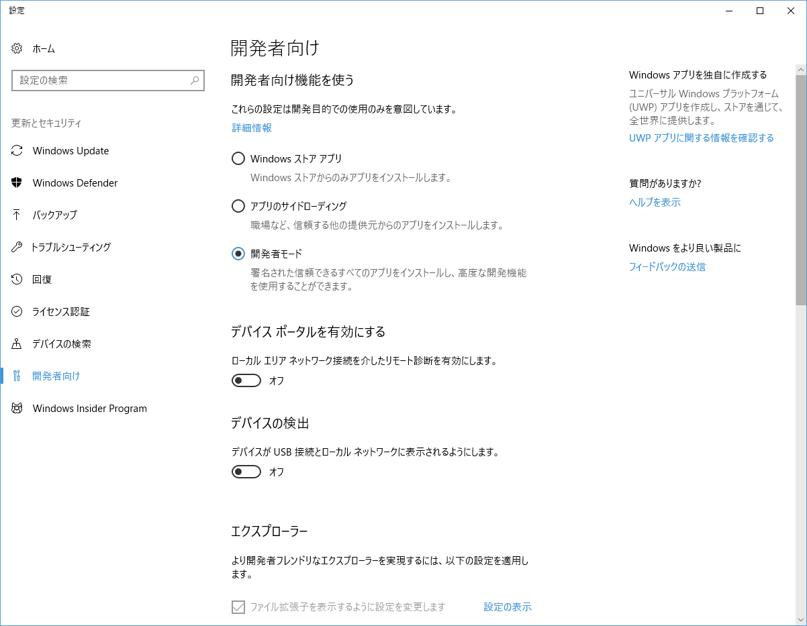
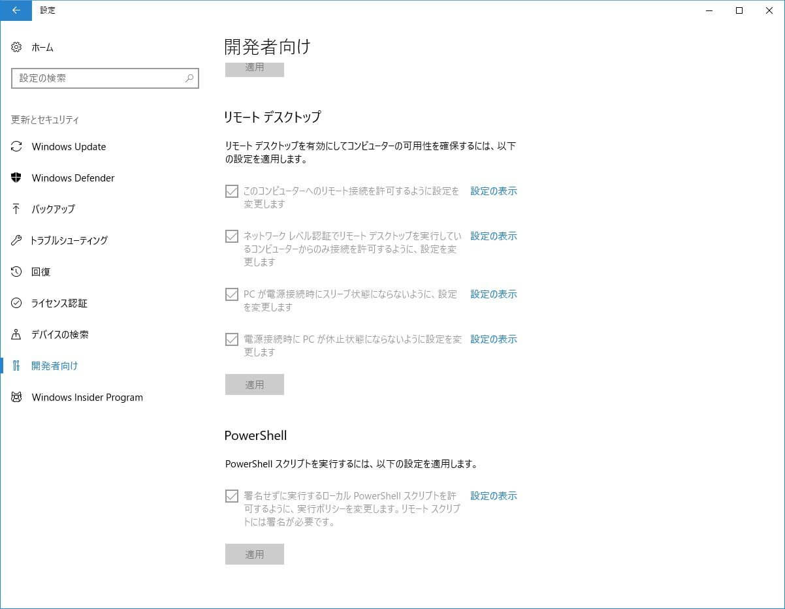
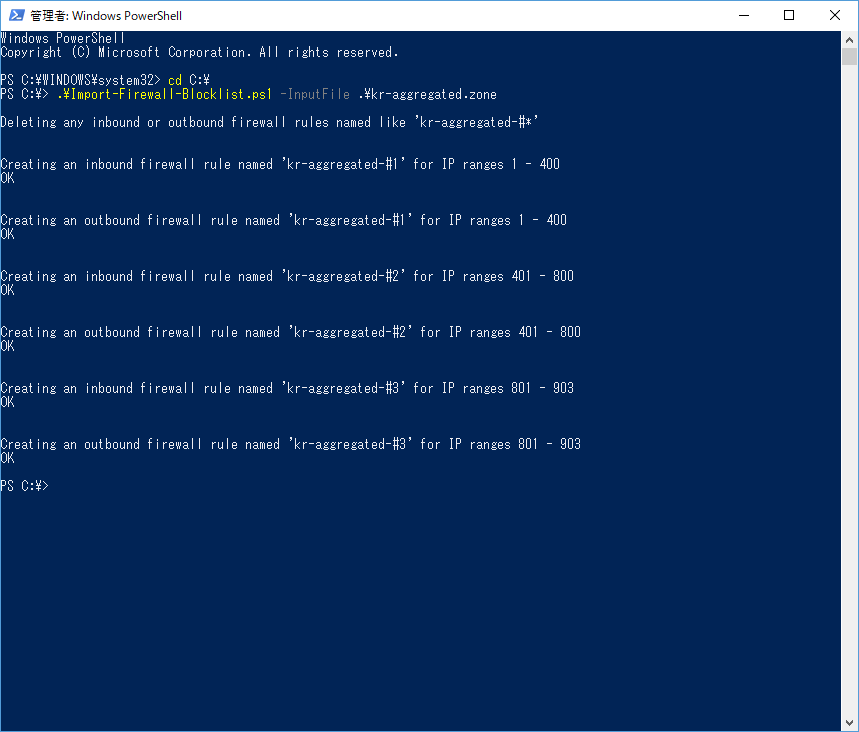
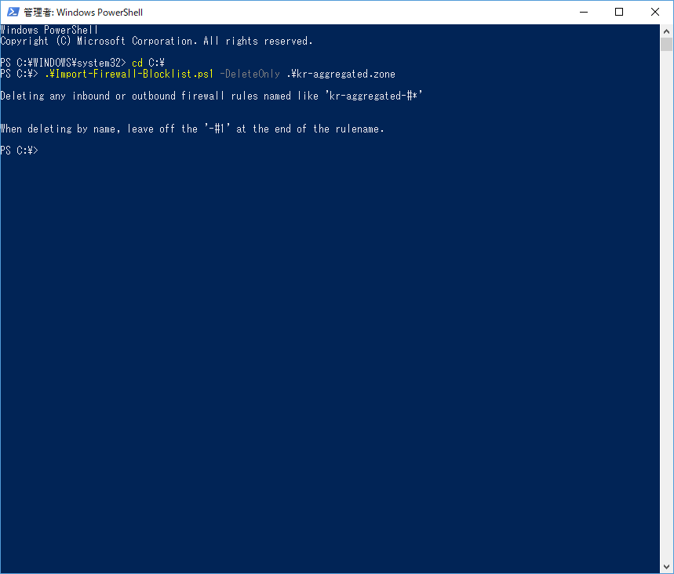
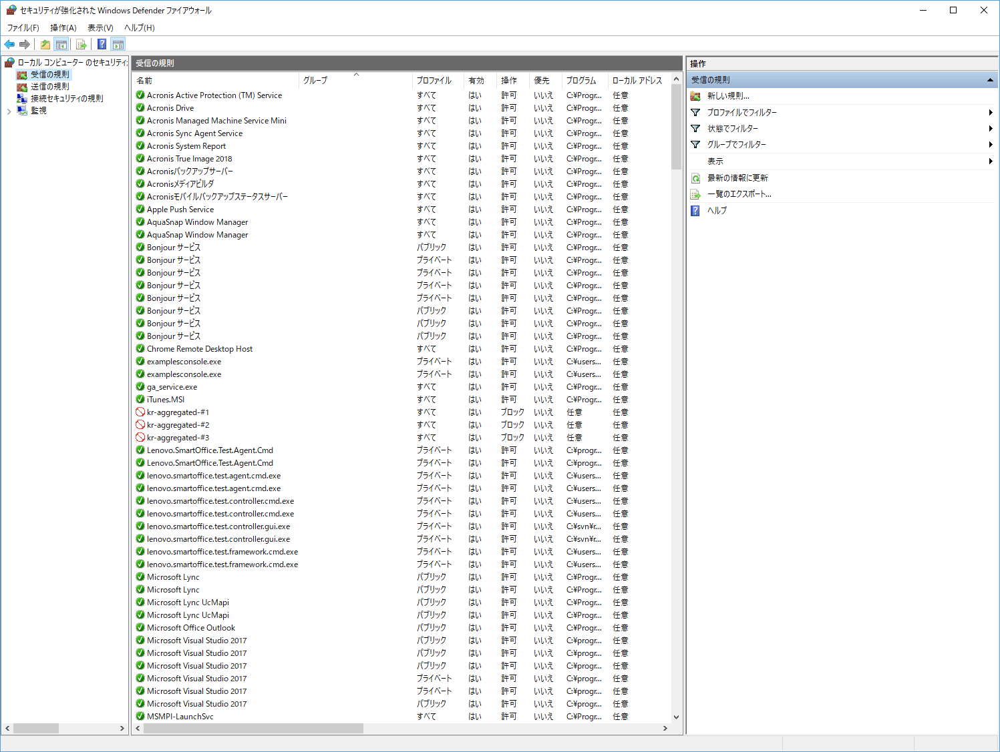

この記事では Windows 上でウェブで拾った国別の IP リストとスクリプトを使って、ファイアウォールのフィルタを追加する方法を説明します。
故に内容自体はゲームサーバーのアプリケーションそのものとはあまり関係がないです。

サーバー構築を専門的にやってる人にとっては大したことない話ですが、個人でゲームのサーバーを建てたい人・建てている人を対象にしたいので、このようなタイトルになりました。また、専門外の方にもなるべく理解していただけるよう、できる限り丁寧に書くよう心がけました。

まずはどのような方法があって、なぜ上記の方法を採ったのか説明したいと思います。

## 外国からのアクセスをブロックする方法のあれこれ

まず、ここから説明していこうと思います。ご家庭でサーバーを建てる場合、大体以下の方法になると思います。

- ルーターのファイアウォールにルールを定義してフィルタする
- OS（ここでは Windows）のファイアウォールにルールを定義してフィルタする
- サーバーで提供したいサービスのアプリケーション（ここではゲームサーバー）でフィルタする

ルールとフィルタという単語が出ましたので説明します。 まず、世の中にあるファイアウォールというのは色んな種類があります。そのうち家庭で目にするものは基本的に

- 「これは通さないで」と指定したものを通さないようにする
- 「これは通して」と指定したものを通す

といったような動作をします。そして

- 「〇〇が ×× だった時、アクセスを許可する（通す）」
- 「△△ が □□ でない時、アクセスを遮断する（通さない）」

という条件の 1 つ 1 つをそれぞれルールといいます。 1 つないし複数のルールを定義し、内部から外部へ・もしくは外部から内部へのアクセスを制限することをフィルタリングと呼びます。

### ゲームサーバーでフィルタしなかった理由

さて、私は 3 つのやり方の中で今回は 2 番目の「**OS（ここでは Windows）のファイアウォールにルールを定義してフィルタする**」を選んだわけですが、大した理由があったわけではありません。

状況によって変わることもありますが、3 番目の「サーバーで提供したいサービスのアプリケーション（ここではゲームサーバー）でフィルタする」というやり方が可能ならばそれに越したことはないと思います。 例えば、今このブログは Wordpress というものが動いていますが、これは国を選んでブロックするプラグインを導入することでフィルタすることができます。 しかし当然ながら、その機能がなければフィルタすることができません。

ゲームのサーバーの話に戻します。 つまり**ゲームのサーバーに国別フィルタ機能がなかったので、他の方法を採った**ということです。 なのでこの記事を読んでいる「ゲームサーバーを建てたい」方はまず、ゲームサーバー自身の機能で国別フィルタができないかどうか調べてみてください。

### ルーターではなく OS でフィルタした理由

ルーターによるフィルタと OS によるフィルタはそれぞれ長所と短所があります。 家庭用を前提とすると、だいたい以下のようになります。

|      |                        ルーターによるフィルタ                         |                                              OS によるフィルタ                                               |
| :--: | :-------------------------------------------------------------------: | :----------------------------------------------------------------------------------------------------------: |
| 長所 | 複数の PC・サーバーに適用できる<br>ルーターのリソースでフィルタできる |                                         スクリプトで簡単に適用できる                                         |
| 短所 |          スクリプトなどで一気に適用できない場合、とても面倒           | 複数台のサーバーがある場合、それぞれで適用しなければならない<br>サーバーマシンのリソースでフィルタしてしまう |

リソースというのは、CPU やメモリのことです。 PC やサーバーなどのコンピューターは、何かするためにメモリや CPU を必要とします。フィルタすることも例外ではありません。 どれほどの CPU を使用するかはサーバーによって違いますが、私の場合は気にならない程度だと判断しました。 また、サーバーも 1 台のみであったため、OS の場合における短所が問題になりませんでした。 その一方で、ルーターによるフィルタはとても大変そうだったため、OS によるフィルタを選択しました。

## 準備

ここまで外国をフィルタするいくつかの手段と、その中で OS によるフィルタを選んだ理由を説明しました。 次は実際に Windows 上で簡単にフィルタをかける方法を説明します。

- フィルタスクリプトの入手
- PowerShell の実行ポリシーを変更
- 国別 IP リストのファイルの入手

### フィルタスクリプト

IP リストのファイルを渡すと、それを元に自動的にフィルタを Windows ファイアウォールに追加してくれる PowerShell スクリプトです。 [こちらのダウンロードリンク](https://gist.github.com/18konoe/63d0f9b0483b73abe0956e0e310920f1/archive/579c8ae15116336b15098f7bf9de60ed46b2be11.zip)から保存してください。 本家ソースは[こちら](https://github.com/KurtDeGreeff/PlayPowershell/blob/master/Import-Firewall-Blocklist.ps1)ですが、日本語 OS だと動作しないため、多少改変したものを[Gist](https://gist.github.com/18konoe/63d0f9b0483b73abe0956e0e310920f1/)に公開しました。 PowerShell スクリプトというのは、新しいバッチファイルのスタイルだと思ってください。 バッチファイルと違い、PowerShell スクリプトは実行するためにセキュリティの設定を変更する必要があります。

### Powershell の実行ポリシーを変更

Windows 10 の比較的新しいバージョンならば簡単です。 設定 → 更新とセキュリティ → 開発者向け から 一番下の[PowerShell]の項目について、チェックが入っている状態で[適用]をします。



標準で PowerShell の項目がない場合は開発者モードにします。



古い Windows 10 ないしそれ以前の OS であるため、この方法が採れない場合はこちらを参考に設定してみてください。

### 国別 IP リストのファイルの入手

[IPdeny](http://www.ipdeny.com/)というサイトの[Country IP blocks](http://www.ipdeny.com/ipblocks/)からブロックしたい国ごとに zone ファイルをダウンロードします。 今回は中国と韓国をフィルタするので、こちらの部分を探します。

#### 韓国

| KOREA, REPUBLIC OF (KR) [[download zone file](http://www.ipdeny.com/ipblocks/data/countries/kr.zone)] Size: 16.95 KB (1129 IP blocks) | [[aggregated zone file](http://www.ipdeny.com/ipblocks/data/aggregated/kr-aggregated.zone)] (903 IP blocks) |
| :-----------------------------------------------------------------------------------------------------------------------------------: | :---------------------------------------------------------------------------------------------------------: |


#### 中国

| CHINA (CN) [[download zone file](http://www.ipdeny.com/ipblocks/data/countries/cn.zone)] Size: 123.13 KB (8133 IP blocks) | [[aggregated zone file](http://www.ipdeny.com/ipblocks/data/aggregated/cn-aggregated.zone)] (4966 IP blocks) |
| :-----------------------------------------------------------------------------------------------------------------------: | :----------------------------------------------------------------------------------------------------------: |


左と右のどちらを使ってもいいですが、今回の説明では右の aggregated を使います。aggregated についてはページの冒頭にこのような説明があります。

> NEW! We offer aggregated country IP zone files downloads below. It means fewer rules and higher performance for firewalls, routers and custom solutions! DB ready table formats are coming soon!

まとめられる部分をまとめたので、ファイアウォールがフィルタする時のパフォーマンスが良くなるとのことです。

## 実行

1. 説明を簡単にするため、スクリプトとダウンロードした zone ファイルを C:ドライブ直下に移動します。
2. PowerShell を管理者権限で起動します。最近の Windows 10 であれば、[Win+X]→[A] のショートカットで起動できます。
3. 下記コマンドで C:ドライブ直下へ移動し、スクリプトを実行します。

```powershell
PS C:\WINDOWS\system32> cd C:\
PS C:\> .\Import-Firewall-Blocklist.ps1 -InputFile .\kr-aggregated.zone
```

コマンドは韓国のファイルでの例です。うまくいけば、このように OK っぽい表示が出ます。



このフィルタを削除する時には、先のコマンドのオプションを少し変えて実行します。

```powershell
PS C:\> .\Import-Firewall-Blocklist.ps1 -DeleteOnly .\kr-aggregated.zone
```

実行するとこのように表示されます。



察しの良い方はお気づきかもしれませんが、ファイアウォールのルールが引数のファイル名を基準に作られています。 なので**ルールを追加した後に zone ファイルの名前を変えてしまうと、削除の際にルールがうまく削除されません。** zone ファイルは変えずに保管しておくことをおすすめします。

## 確認

ちゃんとルールが追加されたか、もしくは消えたか心配な場合は Windows ファイアウォールを見に行きましょう。



詳細設定から、定義されたルールを見ることができます。上記画像から「kr-aggregated-#1」などが追加されているのがわかります。

## おわりに

次は中韓フィルタを使って建てた Rust というゲームのサーバー構築について記事にしようかと思います。

https://konoe.studio/how-to-host-and-manage-rust-server-on-windows/

最後にひとつ、よくある質問への回答を用意させていただきました。

Q. 日本だけ通すようにはできないの？

A. 可能ですが確実ではないのでおすすめしません。

この記事では基本的に「これは通さない」というやり方で、韓国と中国のフィルタをしました。 日本だけ通す場合は、まず日本の zone ファイルを用意して「これは通す」設定をします。 そしてそれより優先度が低いルールに「全て通さない」設定をします。 ではこれがなぜ確実でないのかというと、**国別の zone ファイルがそもそも確実にその国全体の IP を網羅しているとは限らないため**です。 そうであることを前提にフィルタした場合、この記事のやり方は「中国だけどアクセスできた」があり得ます。 今回のゲームサーバーでは中韓のアクセスを 100%阻止したいわけではないため、これは許容できます。 逆に日本だけ通す場合は「日本だけどアクセスできない」が起こり得てしまいます。 前者と後者、様々な事情によってどちらを優先するかは変わりますが、業務ではなく個人でゆるくゲームのサーバーをたてる程度なら、前者のほうが良かろうという私の判断です。
