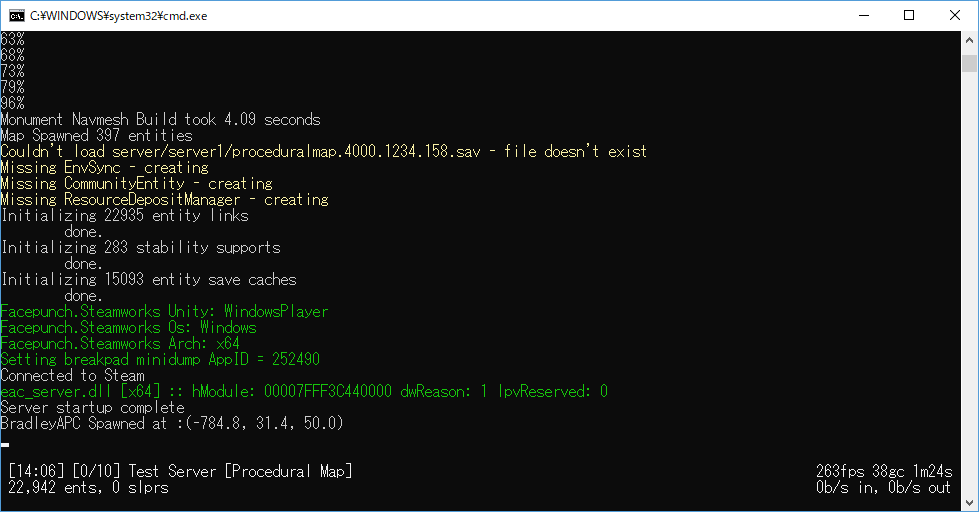

Rust は 2013 年の 12 月より Steam にて、早期アクセスタイトルとして発売していたサンドボックスのサバイバルゲームです。 そして約 4 年の月日が経ち、2018 年 2 月より正式版がリリースされました。

<div class="iframely-embed"><div class="iframely-responsive" style="padding-bottom: 46.7391%; padding-top: 120px;"><a href="https://store.steampowered.com/app/252490/" data-iframely-url="//cdn.iframe.ly/Cg5opTV?omit_script=1"></a></div></div>

私もちょうど、正式版リリースの少し前より Rust のサーバーを建てていましたが、昔と今とでは構築の方法も、ファイルの構成も変わっているため、これを機に記録として残しておきます。

本記事は Windows でのサーバー構築方法となります。 また、ポート開放できることを前提としています。ポート開放の経験がない初心者の方は、別途ポート開放の方法を調査してください。

## サーバーを公開するためのポート開放

Rust のサーバーがデフォルトで使用するポートはこちらになります。

- [UDP] 28015 – ゲーム用
- [TCP] 28016 – RCON 用

後述するサーバーの設定にてポートは変更できます。

## サーバーの構築と起動

かつての情報を見る限りでは、サーバーのファイルは Rust から直接ダウンロードする形式でした。 今は SteamCMD を使ってダウンロードします。

SteamCMD の準備と、SteamCMD を使ったアプリケーションのインストール方法は下記の記事で説明しています。

https://konoe.studio/how-to-setup-steamcmd/

https://konoe.studio/how-to-setup-steamcmd-gui/

- インストール先のフォルダパス：`C:\rustserver`
- インストールするアプリケーションの ID：`258550`

### サーバーの設定

手順をまとめておきます。

1. サーバー起動用バッチファイルの作成
2. バッチファイル内設定の解説
3. スタートアップの設定

#### サーバー起動用バッチファイルの作成

`C:\rustserver`の中に`Run.cmd`というファイルを作成し、メモ帳などのテキストエディタで開きます。 ここも当然、ファイル名は何でも良いです。開いたら下記のスクリプトを貼り付けます。

```cmd
@echo off
cd /d %~dp0

:start

::Rustサーバーファイルの更新
C:\steamcmd\steamcmd.exe +login anonymous +force_install_dir c:\rustserver\ +app_update 258550 +quit

::Rustサーバーの起動
RustDedicated.exe -batchmode +server.port 28015 +server.level "Procedural Map" +server.seed 1234 +server.worldsize 4000 +server.maxplayers 10  +server.hostname "サーバー名" +server.description "サーバーの説明" +server.url "サイトのURL" +server.headerimage "画像のURL" +server.identity "server1" +rcon.port 28016 +rcon.password letmein +rcon.web 1

goto start
```

わかりやすいように 1 行ごとに区切っています。 Windows 標準のコマンド機能についてはここでは説明しません。気になる方は別途調べてみてください。 簡単に説明すると、Rust サーバーを更新してから Rust サーバーを起動しますが、Rust サーバーが終了した際にはまた更新と起動を繰り返します。

#### バッチファイル内設定の解説

Rust サーバーの起動のオプションについて説明します。

`+server.port 28015` : Rust サーバーのゲーム用ポートです。複数台公開しないなら、そのままでいいと思います。

`+server.level “Procedural Map”` : サーバーのマップです。下記のような選択肢があるみたいですが、”Procedural Map” 以外を試したことはないです。

- “Procedural Map”
- “Barren”
- ”HapisIsland”
- ”SavasIsland”
- “SavasIsland_koth”

`+server.seed 1234` : サーバーマップのシード値です。この値によって地形や建物が変化します。値の幅は`0～2147483647`です。

`+server.worldsize 4000` : マップのサイズです。`4000`が標準的なサイズで、値の幅は`1000～6000`です。 ちなみに`6000`にしてみた時にはマップはかなり広くなりましたが、建造物の数は変わらなかったため、結果遠いだけでした。

`+server.maxplayers 10` : サーバーに入れる人数の上限です。マップの広さやサーバーの性能などで調整しましょう。

`+server.hostname “サーバー名”` : Rust のサーバー検索画面に表示される名前です。

`+server.description “サーバーの説明”` : Rust のサーバー検索画面から IN する前に出る画面に表示される説明文です。 日本語も一応書けますが、たくさん書くと所々端折られてしまうのでほとんど書けません。

`+server.url “サイトのURL”` : 上記説明文の画面からジャンプできるウェブサイトの URL です。

`+server.headerimage “画像のURL”` : 接続画面の背景イメージになる画像を URL で指定します。正直気にしたことはないです。

`+server.identity “server1”` : ここで指定した名前のフォルダが`C:\rustserver`の`server`フォルダ内に作成されます。 そしてその中にマップや BP、サーバー毎の設定ファイルが作成され、保存されます。 つまりこの例では `C:\rustserver\server\server1\` に保存されます。

`+rcon.port 28016` : Rust サーバーの RCON 用ポートです。複数台公開しないなら、そのままでいいと思います。

`+rcon.password letmein` : RCON のパスワードです。必ず変更しましょう。

`+rcon.web 1` : 1 にしておくと、後述する WebSocket を使った RCON 接続サイトからサーバーコンソールにアクセスできます。 特に理由がなければそのまま 1 にしておくことをおすすめします。

#### スタートアップの設定

Windows Update などで自動的に再起動した場合を想定し、先ほど `C:\rustserver`の中に作った`Run.cmd`をスタートアップに登録します。 [Win+R] のショートカットで`shell:startup`と入力して OK すると、スタートアップ用のフォルダが開きます。 この中に`Run.cmd`のショートカットを入れておくと、再起動した時に自動で起動します。 ショートカットは、`Run.cmd`を右クリックでドラッグアンドドロップすると、右クリックメニューの中にショートカットを作成があると思います。

#### サーバーを起動する

作成した`Run.cmd`を実行しましょう。Windows ファイアウォールが許可を求めてくる場合は、許可してください。 このような画面になれば成功です。



## サーバーの運用

サーバーを構築してそれで終わりではありません。今後はこのサーバーを運用していく必要があります。 コマンドについては調べればいくらでも出るので、ここでは Web からのアクセスするツールなどを紹介したいと思います。

### 運用のための基本

まず、先ほどの画面の下に白いアンダーバーが見えるでしょうか？ そこで管理者コマンドを入力することができます。 また、この画面では人の出入りやチャットを見ることができます。人が入ってくると

```
名前 [サーバー内ID/その人のSteamID] has entered the game
```

などと表示されます。この組み合わせは特に重要です。 なぜなら、**コンバットログではサーバー内 ID が表示され、BAN するには SteamID が必要**だからです。 どうもこの画面のログはファイルに出力されないようで、この画面を選択して [Ctrl+A] → [Ctrl+C] などで素早くここに表示されているログをコピーし、テキストエディタに貼り付けて使っています。 この画面のログをファイルに出力する方法をご存じであればご教示いただきたいです。

### RCON:IO でコマンド入力する

少し運用してみると気付くかもしれませんが、標準のコンソールでは日本語が文字化けします。 そこで、WebSocket を使用した、RCON 接続できる Web サイトを利用することをおすすめします。

http://rcon.io/

上記ページにサーバーの IP とポート、パスワードを入力すると管理コンソールにログインできます。 このツールを使うことで、サーバーが稼働している以外の PC からコンソールにアクセスできる利点もあります。 また、上のタブから Chat やプレイヤー一覧などを確認したり、その場で BAN したりすることも可能です。

## FAQ

Q. 科学者 (Scientist) の NPC をスポーンするようにするには？

A. cfg フォルダの serverauto.cfg に下記の行を追加します。

```
squadmanager.squad_disable “False”
```

または下記サイトが参考になりそうです。

<div class="iframely-embed"><div class="iframely-responsive" style="height: 140px; padding-bottom: 0;"><a href="https://www.corrosionhour.com/rust-scientist-command/" data-iframely-url="//cdn.iframe.ly/P2peLdH?iframe=card-small&omit_script=1"></a></div></div>

## その他の参考ページ

Rust サーバー構築方法について

https://www.rustafied.com/how-to-host-your-own-rust-server/
