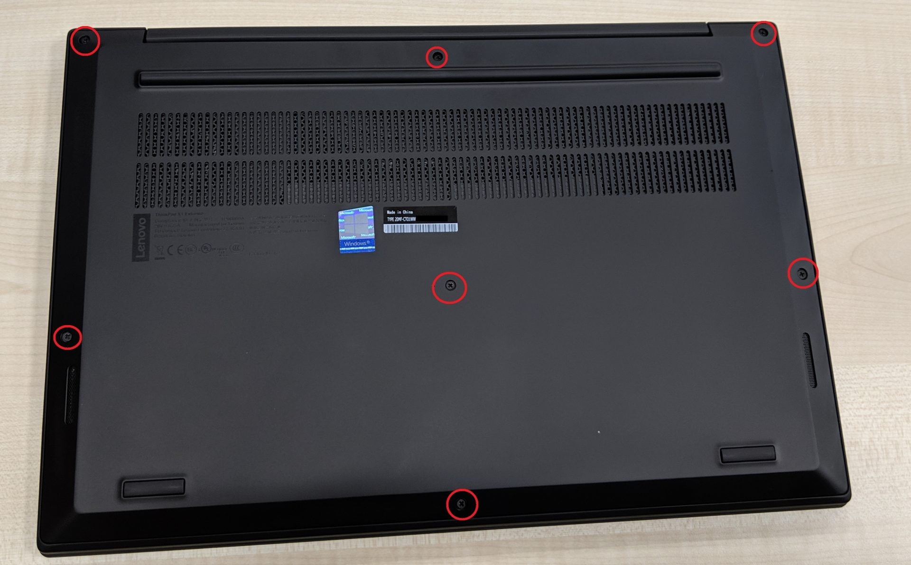
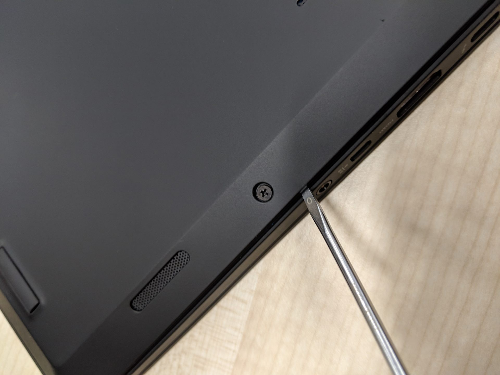
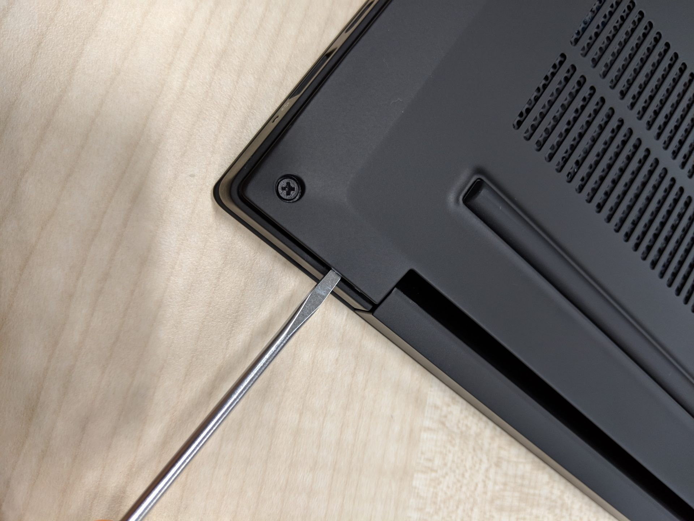
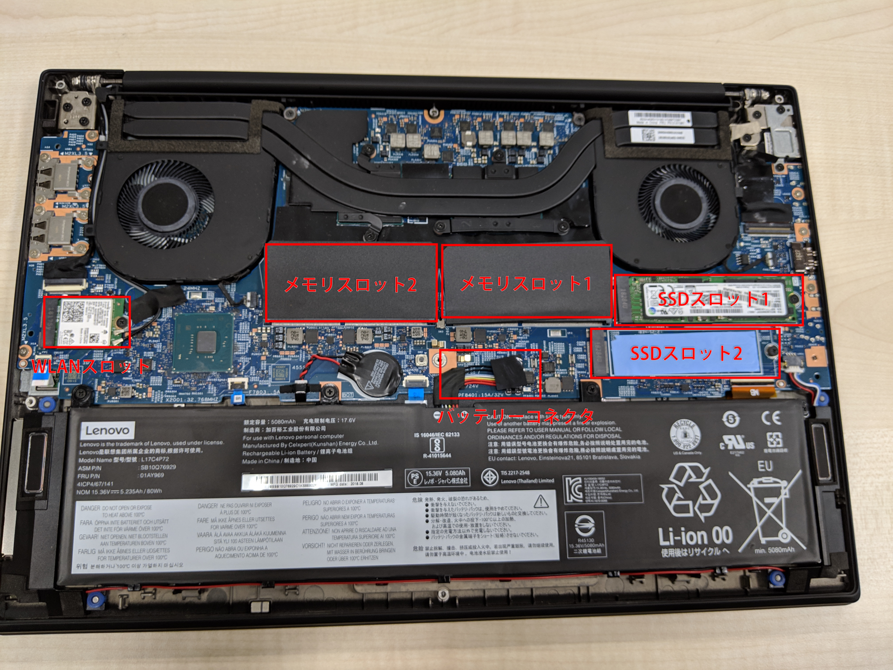
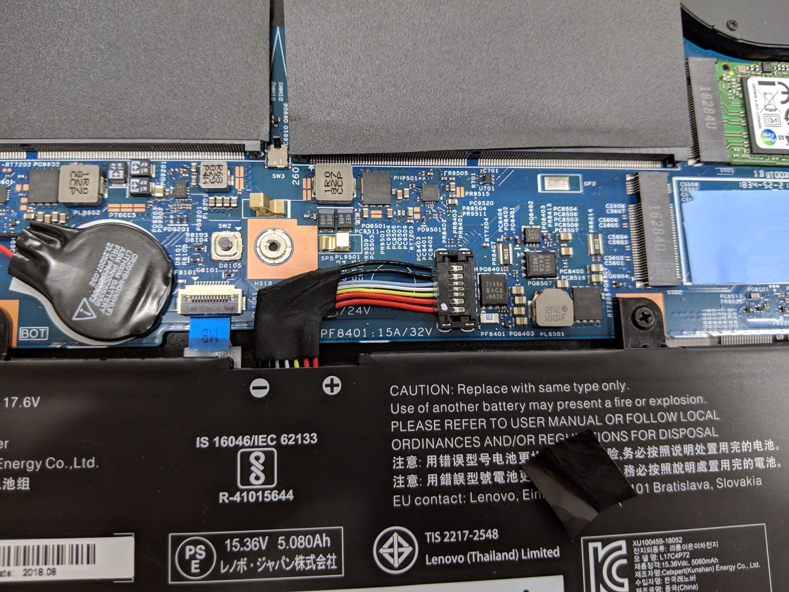
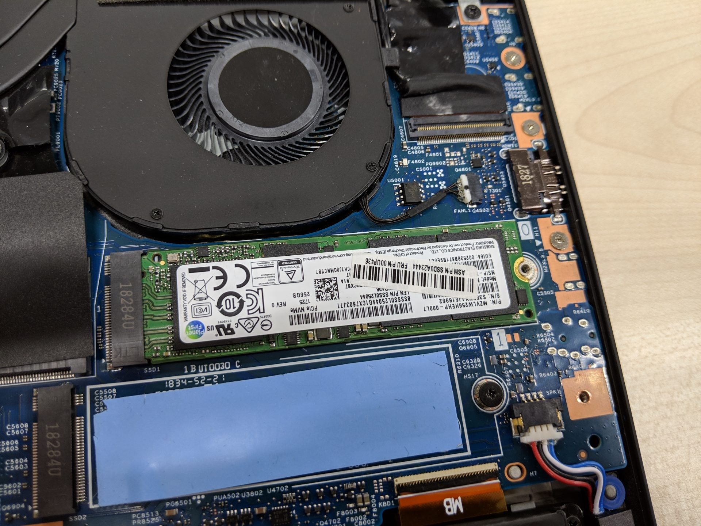
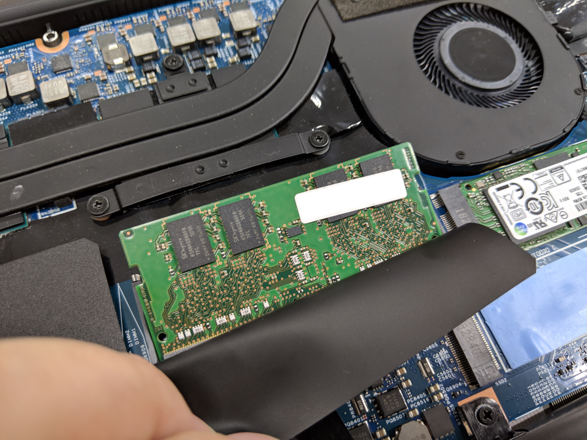
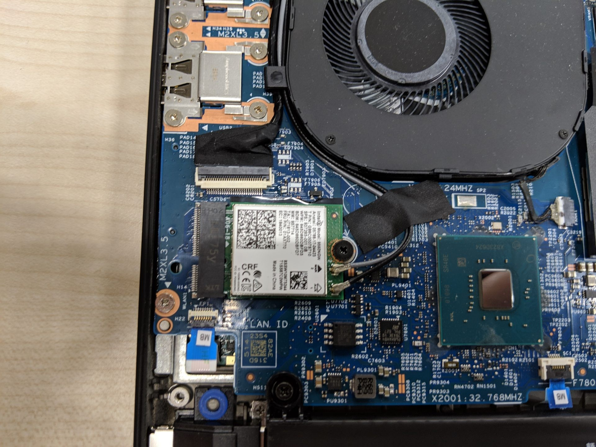

Lenovo の ThinkPad X1 Extreme のメモリと SSD を交換する方法について解説します。
ThinkPad P1 も同様の筐体だと思うので、参考になるかと思います。

## 裏蓋を外す

昨今の ThinkPad は薄型化のため、従来のように側面から HDD/SSD を出したり、裏側にメモリ用の蓋だけネジ止めされてはいません。
裏側の蓋は 1 枚になり、それを外してアクセスする必要があります。ThinkPad X1 Extreme/P1 は大型であるため、比較的交換が容易です。

### ネジを緩める

まずは画像の赤丸部分のネジを緩めます。
最近の ThinkPad はネジが抜けないようになっているため、固定部から完全に外れたかがわかりにくいです。

## 蓋を外す

ネジを緩めて浮いてきた蓋と本体との隙間に薄いものを差し込み、徐々に広げていきます。手前よりも側面や背面に隙間があると思います。

ネジの緩め具合が足りないと蓋が外れません。
外れにくい場合は無理に外そうとせず、ネジがちゃんと固定部から外れるまで緩められているか確認してください。

## 内部紹介と交換方法

裏蓋がとれたら中身を確認しましょう。

### バッテリーコネクタ（外すのは任意）

コネクタ部にはシールが貼られており、剥がすとこのようになっていました。このコネクタを外す時に破損の恐れがあるなと感じたので、私はバッテリーを接続したまま交換しました。

バッテリーを外す方が安全に作業できますが、接続部を破損させてしまう恐れがあります。
逆にバッテリーを外さずに作業をして、感電や破損させてしまう可能性もあります。
BIOS 設定には内臓バッテリーを無効にする設定があるので、そちらを活用するのがおすすめです。

### SSD スロット

写真のように SSD のスロットと反対にあるネジを外すことで交換ができます。

交換には M.2 SSD が必要です。私は PCIe 接続の SSD（NVMe）しか試していないのでわかりませんが、恐らく SATA タイプの M.2 SSD も使用できると思います。 ThinkPad でよく使われる SSD は Samsung や東芝ですが、ほとんど Samsung なのでそちらのほうが無難かと思います。

2 番目のスロットに青いシートが貼ってあります。これは SSD の熱対策に必要なものです。
私は購入時点で SSD を 2 つ入りで注文したのでシートがついていますが、1 枚で注文した場合にシートがついているかわかりません。

もしついていなかった場合は下記のようなシートを自分で購入して貼る必要があると思います。

### メモリスロット

黒いシートの下にメモリスロットがあります。めくるとメモリが見えるので、両サイドの爪を開けばメモリが交換できます。

交換には DDR4 の SO-DIMM が必要です。ThinkPad でよく使われている Samsung や Micron のメモリと交換するのが無難かと思います。

### WLAN スロット

Wi-Fi に接続するためのカードが接続されています。ほとんど交換することはないと思いますが、交換の際にはアンテナケーブルがどちらに刺さっていたかを忘れないようにしてください。

## 裏蓋を戻して動作確認

裏蓋は手前側を引っかけてから全体にかぶせます。全体的に押すと、ネジを止めなくてもある程度パチッパチッとはまっていくのがわかると思います。この状態で動作確認を行い、問題無ければ裏のネジを固定するのが効率的かと思います。

BIOS でバッテリーを無効化した場合は、一度電源コネクタを接続して起動するとバッテリー接続が戻ります。

## おわりに

ThinkPad は比較的メモリや SSD の交換が行いやすいノート PC です。あらかじめ交換可能なパーツを調べておくことで、購入時点では安く済ませて後からアップグレードができる点は魅力的だと思います。
