Minecraft でフレンドなどとマルチプレイをするにはサーバーを立てる必要があるのはプレイヤーの皆さんならご存じかと思います。 自分で立てるのは電気代やサーバーの準備・手間などがあって大変ですし、かといってレンタルサーバーは基本的に有料で、その割にスペックが低いです。 今回は**無料でそこそこ使える**Minecraft のサーバーを提供している[Aternos](https://aternos.org/ja/)の紹介と、導入方法を説明します。

## Aternos とは？

無料で使える Minecraft のレンタルサーバーのサービスです。Web から簡単に設定ができて、無料の割に普通に遊べるスペックを割り当ててくれます。 そして何より Web からの設定で MOD を入れることもできるなど、かなり便利です。実際に遊ぶだけでなく、テスト目的としてもかなり有用だと思います。

- 完全無料でそこそこ遊べる
- Web から簡単に設定・起動
- MOD も簡単に導入できる

Q. 完全無料でどうやって運営しているの？

A. Web の設定画面に表示される広告収入で運営しているようです。

後述するデメリットによって、常に人が動いているサーバーでなければ頻繁に Web 設定画面を開くため、広告収入が期待できるのだと思います。

Q. デメリットはないの？

A. ユーザーがいないと 5 分ほどで止まってしまうため、再起動する手間がかかる

ユーザーがいないとサーバーリソースの節約のために 5 分ほどで強制停止されてしまいます。ユーザーがいてもアイドル状態だと同様に停止されてしまうようです。 じゃあ管理者が常に見張っていないとダメなのかというとそうでもなく、Aternos では他のユーザーに起動などの権限を持たせることができます。 後半で具体的に説明しますが、サーバー利用者が全員フレンドであればその人達に Aternos のアカウントを作成してもらい、全員に起動する権限を与えることで使いたい人に起動してもらうような工夫もできます。

## 基本の導入方法

まずは登録からバニラの実行までやってみましょう。

[Aternos への登録画面](https://aternos.org/go/)にある「+サーバーを作成」で登録を開始します。

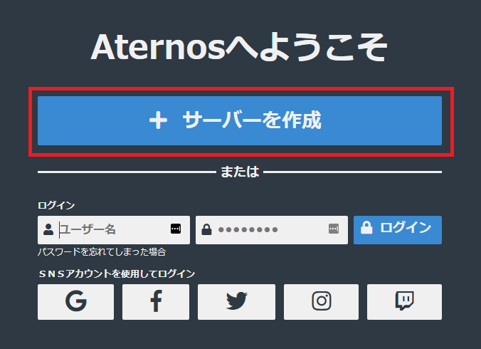

ユーザー名を設定します。プライバシーポリシーを確認した上で同意できるならば右側のスイッチをチェックし、次へ進みます。

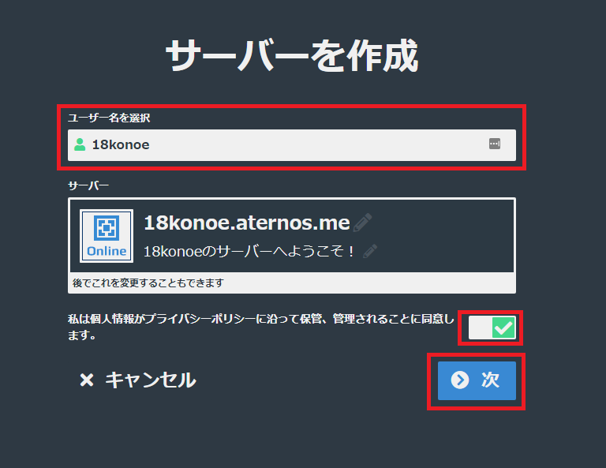

メールアドレスとパスワードを設定して新規登録します。ここで Google や Facebook のアカウントを使ってログインできるようにすることも可能なようです。

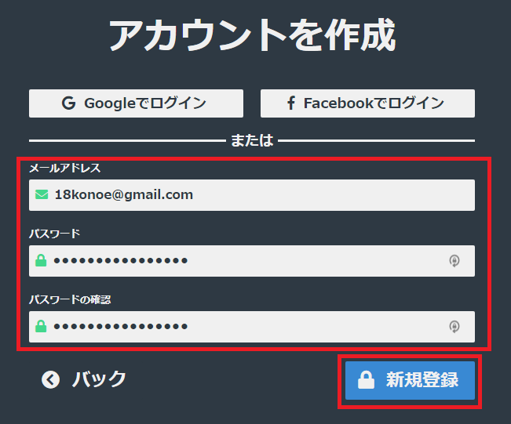

成功すればこのような画面へ遷移すると思います。

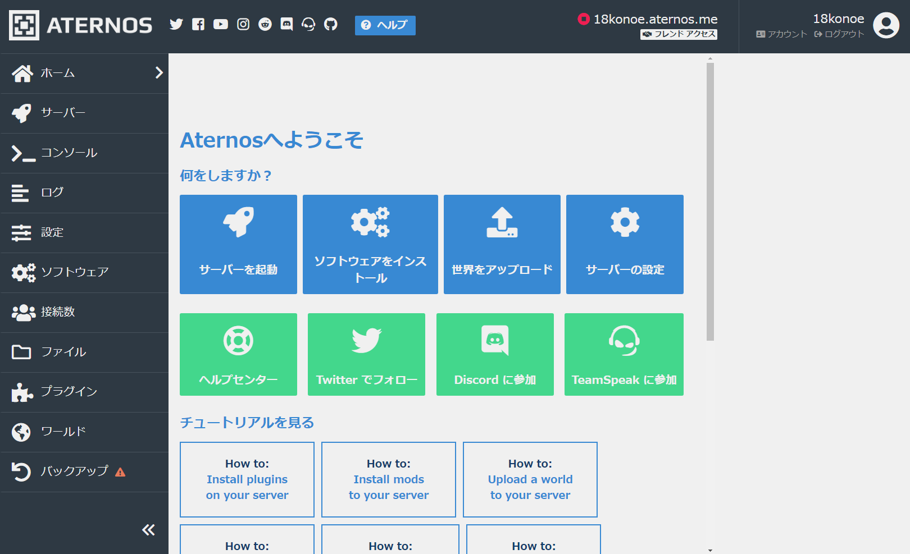

### バニラのサーバーをインストール

デフォルトでは PaperMC というバニラではないサーバーがインストールされているため、設定が必要です。左ペインにある「ソフトウェア」からインストール可能なソフトウェア一覧画面へ遷移しましょう。

導入可能なソフトウェア一覧が表示されるので、左上にある「Vanilla」を選びます。

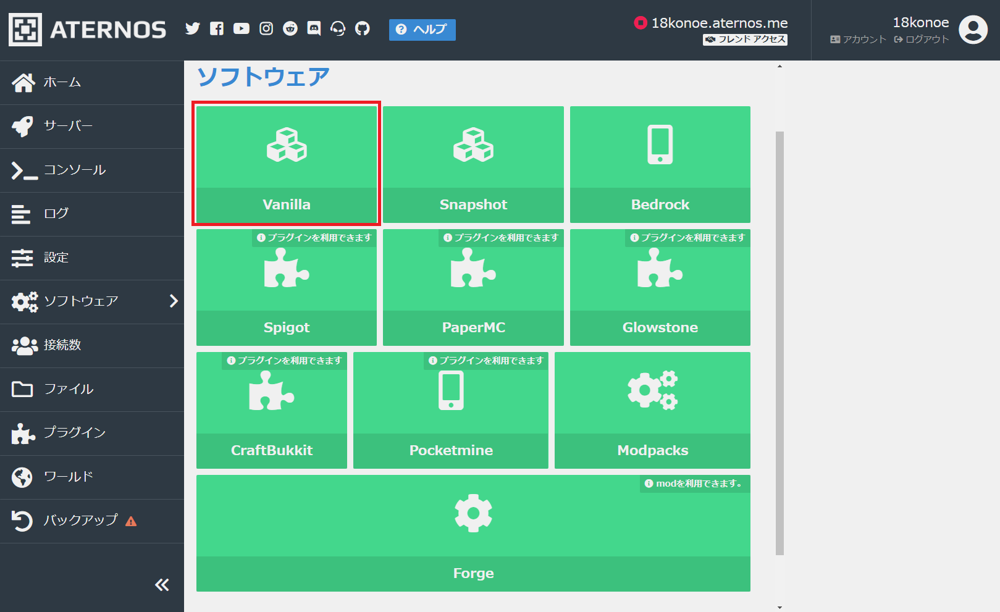

インストール可能なバージョン一覧がずらっと表示されます。今回は最新の 1.13.2 を選択しました。

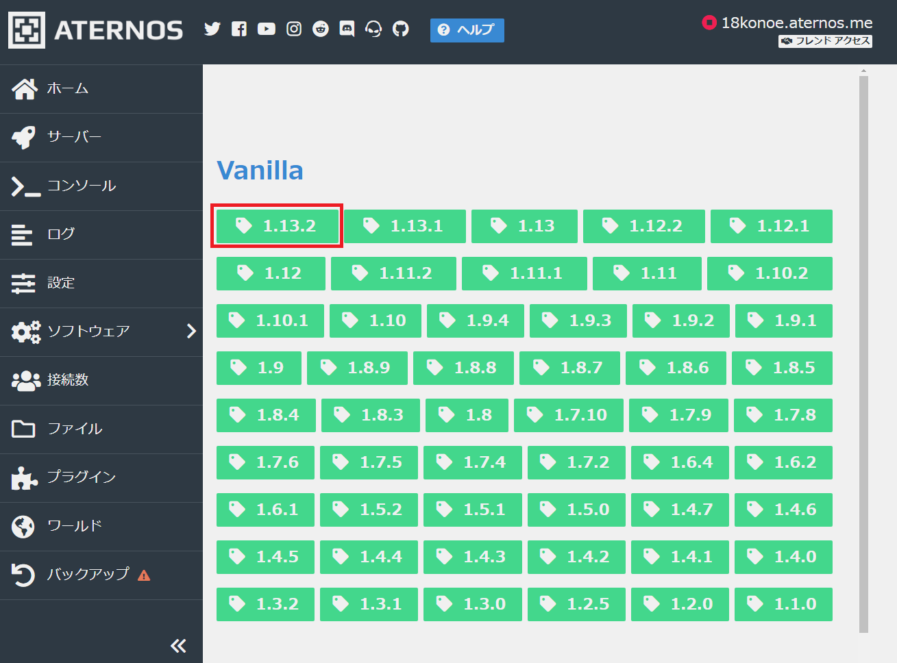

「インストール」を押すとインストールが始まり、成功すればチェックマークに変化します。

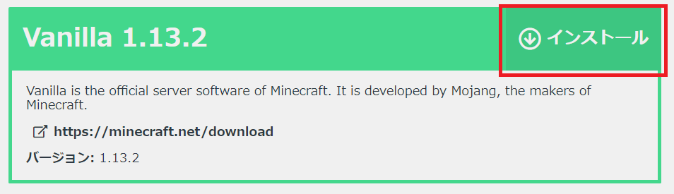

これでバニラのサーバーインストールができました。超簡単ですね。

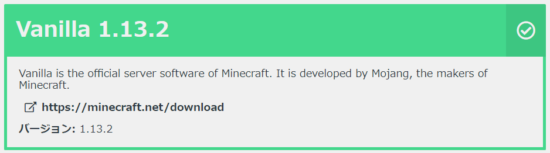

### サーバーの設定

左ペインの「設定」から、これから立つ Minecraft のサーバーについての設定ができます。

最低限、設定したほうがいいのは時間帯です。日本なので「Asia/Tokyo」を選択しました。日本語が怪しいところがありますが、後はお好みで設定して下さい。

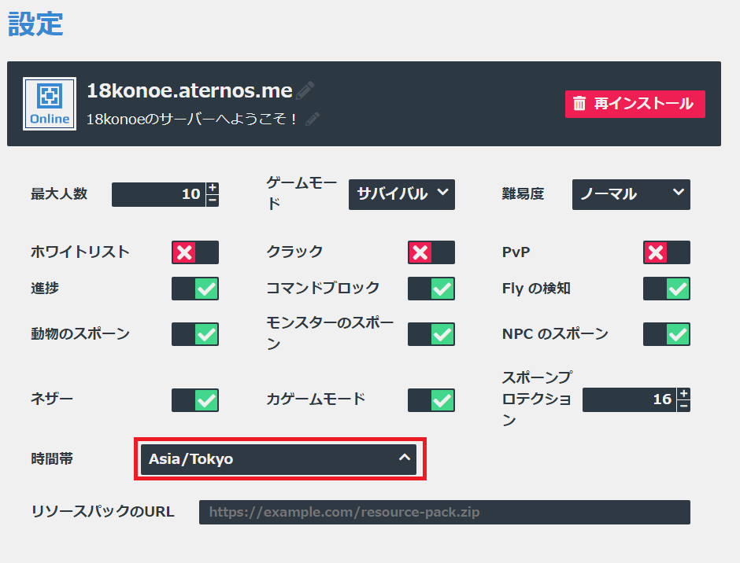

### サーバーの起動

左ペインの「サーバー」から起動画面へ遷移できます。

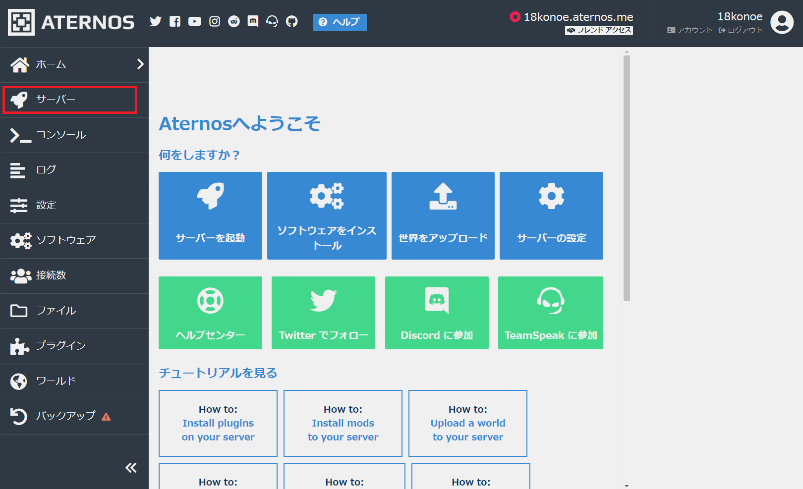

中央にある「起動」ボタンを押すと、起動を開始しますが･･･すぐには起動しません。

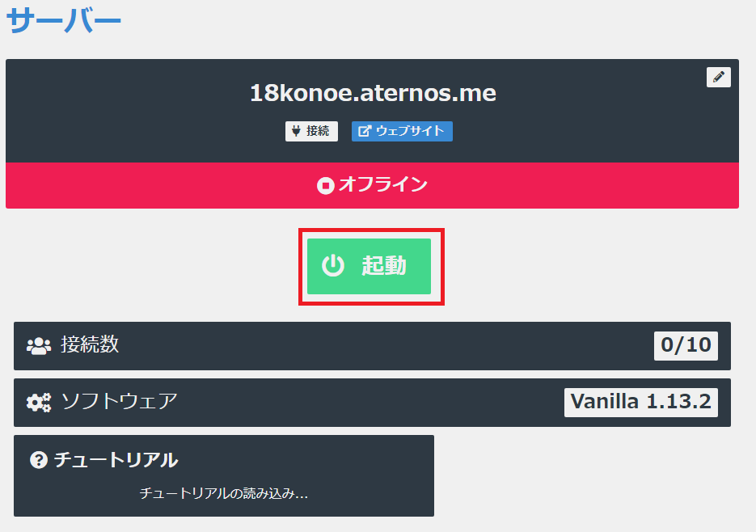

まずは EURA に同意します。

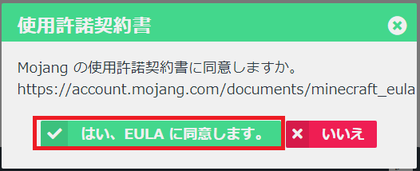

起動したら通知するか聞いてきます。「確認」を押して Chrome の通知を許可することをおすすめします。

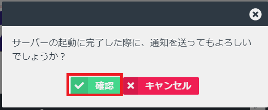

バニラだからかわかりませんが、混雑していなければ即座に起動するのではないでしょうか。

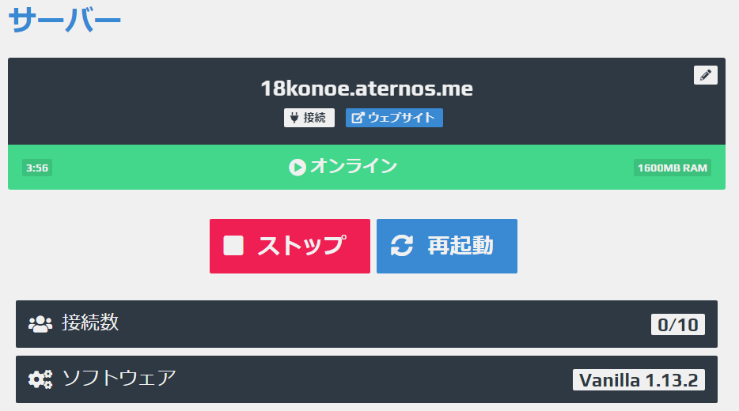

### すぐに起動しなかった場合の対応

サーバーが混雑してくるとすぐに起動できず、自分のサーバーを起動してもらう順番がくるまで待つ必要があります。 その場合は先ほどの通知を ON にしていれば、自分の番が近づいてきたら音が鳴って知らせてくれます。**音が鳴ったら 1 分以内に「すぐに確認」ボタンを押さないと起動できません。**

## その他の設定について

バニラでサーバーを立てる以外に必要と思われる、基本的な設定方法を説明します。

### サーバーをリセットする方法

左ペインの「設定」から「再インストール」で初期化できます。

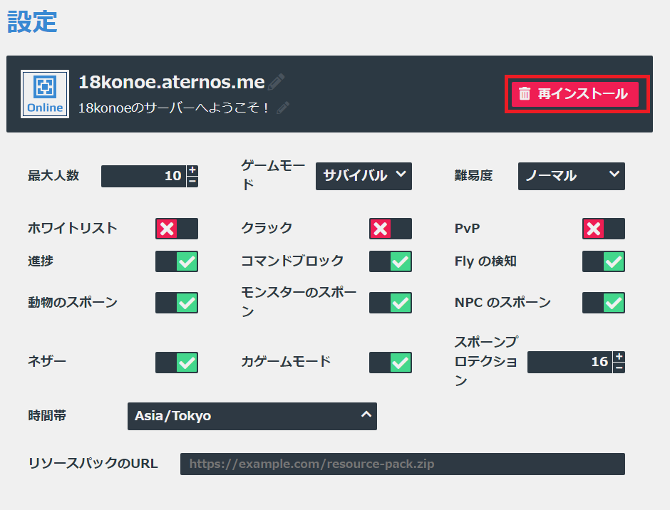

### 他のユーザーでもサーバーを起動できるようにする方法

右上の「フレンドアクセス」でフレンド アクセスの画面へ移動します。

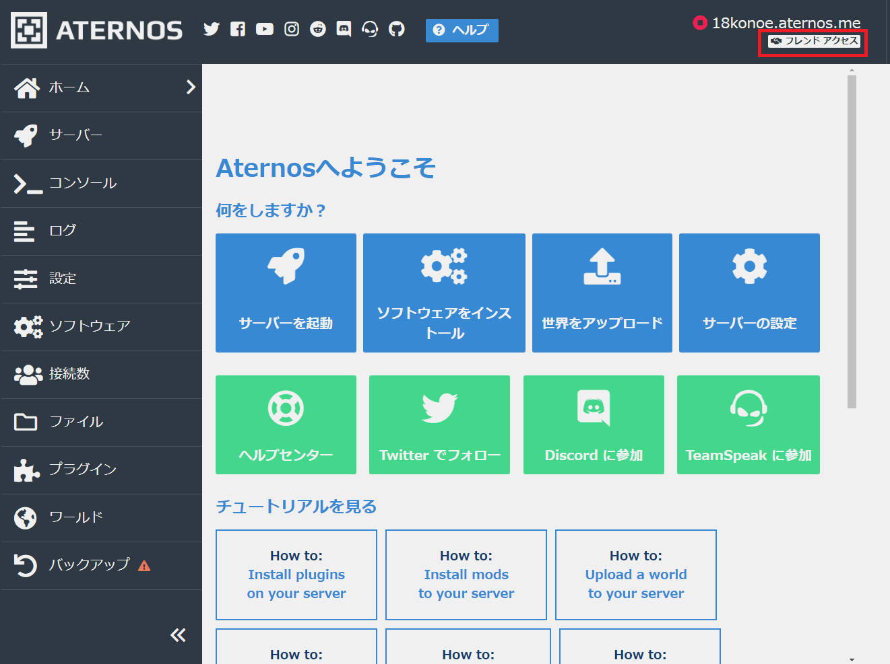

アクセスを許可するユーザー名を入力し、「＋」ボタンを押すと追加できます。

「起動」と「ストップ/再起動」にチェックを入れ、「保存」を押します。

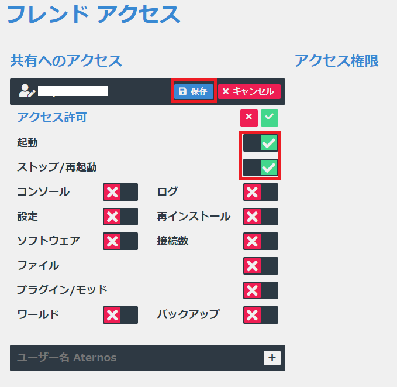

これでサーバーが強制停止させられても、フレンドに再起動してもらうことができるようになります。

## おわりに

Aternos を使って Minecraft のマルチプレイ用サーバー（バニラ）を立てる手順について説明しました。 次回は Mod Pack の導入や、その他便利な設定項目について解説できたらと思います。

https://konoe.studio/how-to-use-free-minecraft-server-aternos-advanced/
