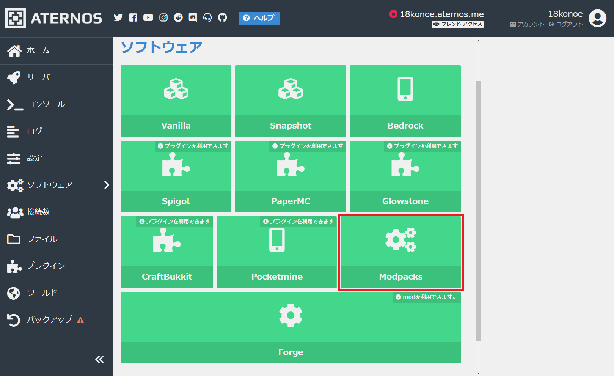
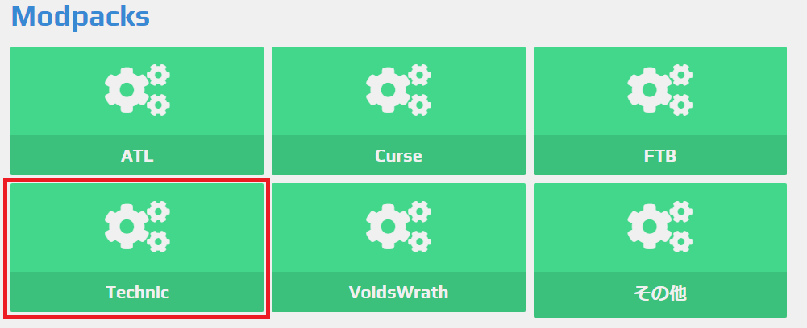
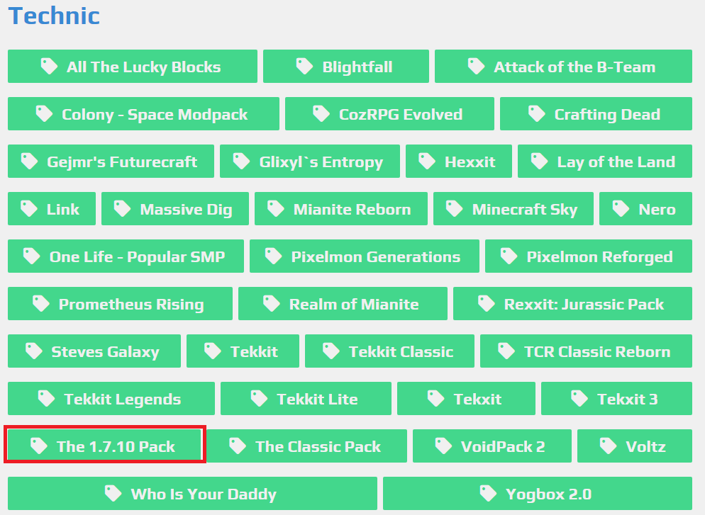
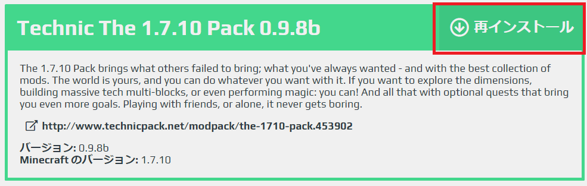
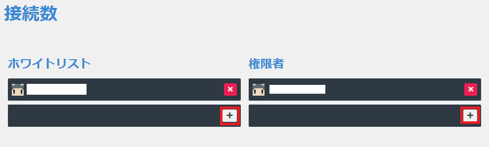
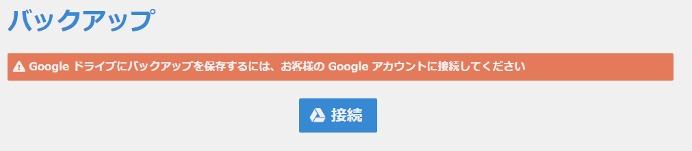
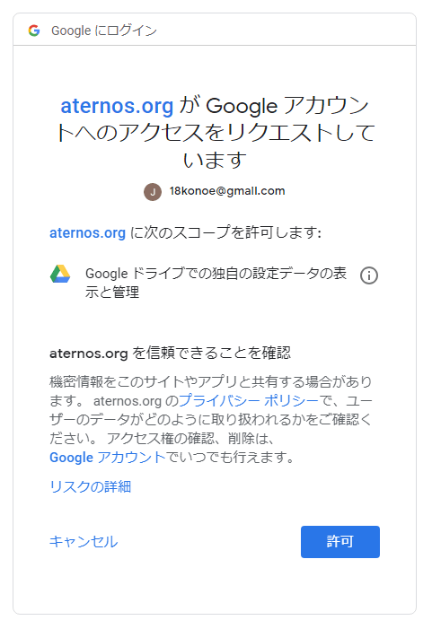
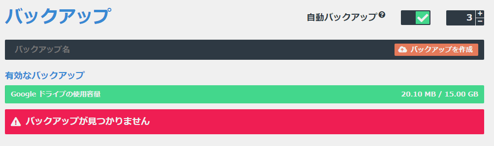

前回の記事では無料で使える Minecraft のサーバー・Aternos の登録からバニラでの起動方法といった基本的な利用方法を解説しました。

https://konoe.studio/how-to-use-free-minecraft-server-aternos/

今回は簡単にできる Mod Pack での導入方法と、その他便利な設定について説明していきたいと思います。

## Mod Pack の導入方法

Mod Pack とは、有志によって作られた Mod のセットです。ここでは Technic というランチャーにある、The 1.7.10 という Mod Pack をインストールします。 といってもバニラのサーバーとやることは変わりません。左ペインの「ソフトウェア」から「Modpacks」を選びます。

複数の Mod Pack 用ランチャーが選べることがわかります。今回は「Technic」を選びます。

すると沢山の Mod Pack が出るのがわかります。この中から今回は「The 1.7.10 Pack」を選んでインストールします。

バニラと違って右上が「再インストール」となっていますが、気にせずインストールしましょう。

**なんと、もう終わりです。**後はバニラの時と同じように、左ペインの「サーバー」から「起動」を押すだけで Mod Pack のサーバーが立ちます。楽勝ですね。

## 便利な設定

前回の投稿では紹介しきれなかった機能についていくつか説明してきたいと思います。

### ホワイトリストと Minecraft 内の管理者（OP）の設定

左ペインの「接続数」から設定できます。空の枠内に Minecraft 上で表示されるユーザー名を入力し、「+」ボタンで追加できます。

もしくは「コンソール」からコマンド入力でも可能です。こちらのほうが慣れている方も多いのではないでしょうか。

### バックアップの設定

Artenos では自分の Google ドライブと紐付けることで、自動でバックアップする機能を利用することができます。

左ペインの「バックアップ」から入れます。Google アカウント以外でのログインだった場合は画像のようなメッセージが表示されると思います。

Google アカウントでログインし、接続を許可すると紐付けることができます。

Google ドライブとの連携が完了すると、こちらの画像のような画面になると思います。

このページで手動バックアップや、自動バックアップの ON/OFF 及び最大バックアップ個数を設定できます。

今回 Technic の MOD Pack である The 1.7.10 のでの建て方を解説したので、次回はクライアント側の導入方法を解説できればと思います。
