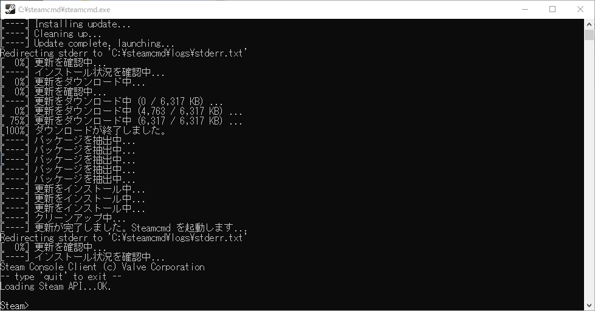

Steam で配信されているゲームのサーバーを立てるときに、SteamCMD を使う必要があることが時々あります。

このブログで紹介した Rust というゲームのサーバーを立てるときに必要となりましたが、今後他のゲームサーバーを構築する記事でも必要になるかもしれないので、SteamCMD 導入方法をこちらの記事に移したいと思います。

## SteamCMD とは

皆さんが普段インストールする Steam クライアントの、コマンドライン版です。

多くの人はグラフィカルな画面をマウスで操作する、GUI のアプリケーションを利用すると思います。ですが自分で操作せずにプログラムから自動で操作するようにしたい場合は、コマンドで操作する CUI アプリケーションが好まれます。SteamCMD も同様の理由で提供されている、CUI 版の Steam クライアントアプリケーションです。

同じ Steam のクライアントなら、SteamCMD じゃなくてもいいじゃないか･･･と思うかもしれませんが、実はその通りです。

### なぜ SteamCMD を使うのか

それはログインせずにダウンロードできるアプリケーションを取得するためです。

Steam で配信されているゲームサーバーのアプリケーションは、ログインしなくてもダウンロードすることができるようになっています。しかし GUI 版の Steam クライアントはそもそもログインしないと使えないようになっています。それを避けるため、SteamCMD を使うのです。

じゃあログインすると何が悪いのか？GUI 版の Steam からゲームサーバーのアプリケーションをダウンロードして実行してみるとこのようなことがわかります。

- フレンドにサーバーのアプリケーションの実行を知らせてしまう
- サーバーアプリケーション実行中は他のゲームができなくなってしまう

これは困りますよね？ゲームとサーバーが別々の PC ならいざ知らず、普通にゲームを楽しむだけのユーザーはサーバー用にする PC など持っていないことがほとんどだと思います。

ちなみに当ブログでは「SteamCMD を GUI から実行するツール」である SteamCMD GUI の導入も説明しています。併せて参考にしていただければ幸いです。

https://konoe.studio/how-to-setup-steamcmd-gui/

## SteamCMD のインストールと起動

### フォルダの作成

まずは`C:\steamcmd`フォルダを作成してください。もちろん説明の便宜上であるため、読み替えられる上級者の方はどこでもいいです。

### SteamCMD のダウンロード

こちらから SteamCMD for Windows をダウンロードします。

https://steamcdn-a.akamaihd.net/client/installer/steamcmd.zip

### SteamCMD の解凍と設置

ダウンロードした`steamcmd.zip`の中身である、`steamcmd.exe`を先ほど作成した`C:\steamcmd`の中に置きます。

### SteamCMD を実行

`steamcmd.exe`を実行すると、自動で自身を最新の状態に更新し、下記のような画面になると思います。



重要なのは一番下に `Steam>` とコマンドが入力できる状態になっていることです。

## インストールするアプリケーションの情報

前提として二つの情報が必要です。

- インストール先のフォルダパス
- インストールするアプリケーションの ID

**インストール先のフォルダパス**は、これから SteamCMD を使ってインストールするアプリケーション達をどこに保存するかを指定する、フォルダの宛先です。どこでもいいですが、SteamCMD をインストールした場所とは別の場所にすることをおすすめします。この記事では`PATH`と表現するので、各自で読み替えて下さい。

**インストールするアプリケーションの ID**は、Steam 上で設定されている、アプリケーションに対応する ID です。この記事では`ID`と表現するので、各自で読み替えて下さい。

補足ですが、ID は下記のサイトから調べることもできます。

https://developer.valvesoftware.com/wiki/Steam_Application_IDs

サーバーに関してはこちらです。

https://developer.valvesoftware.com/wiki/Dedicated_Servers_List

### アプリケーションのインストール

先ほど表示できた SteamCMD のコンソールに、下記コマンドを入力してインストールしていきます。

```
Steam> login anonymous

Connecting anonymously to Steam Public...Logged in OK
Waiting for user info...OK

Steam> force_install_dir "PATH"

Steam> app_update ID
 Update state (0x3) reconfiguring, progress: 0.00 (0 / 0)
 ...省略...
 Update state (0x61) downloading, progress: 99.51 (7798391045 / 7836989509)
Success! App 'ID' fully installed.

Steam> quit
```

最後のコマンドで SteamCMD が終了します。 `PATH`をみると、`ID`のアプリケーションがインストールされていることがわかります。
