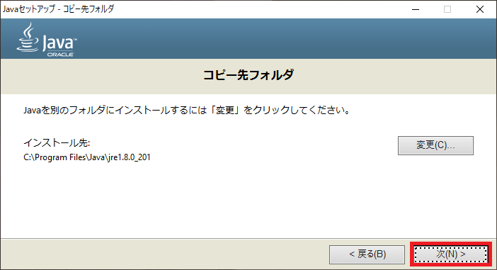

今の Minecraft ではインストールすると Java が既に入っているため困ることはないですが、このブログで紹介している Technic Launcher をはじめとした、非公式のランチャーを使う場合は手動で Java をインストールする必要があります。

2019 年 4 月から Java のサポートが有償化されることもあって、Java バージョン 8 は推奨されませんが、Minecraft では必要なので導入方法を記事にしておきます。

## ダウンロード

自分でバージョンを選択する方法もあるのですが、それが必要な人には恐らくそんな記事必要ないと思うので、一番簡単な方法を説明します。

https://java.com/ja/download/

リンク先のページに堂々と鎮座している「無料 Java のダウンロード」をクリック。

赤線の部分が正しいか（特に 32 ビットか 64 ビット）を確認し、「同意して無料ダウンロードを開始」を押すと Java のインストーラーをダウンロードします。

ファイルはサイズが 70MB くらいはあると思います。

## インストール

ダウンロードできた Java のインストーラーを起動すると、下記のようなウィンドウが出ると思うので、**左下の「宛先フォルダを変更する」にチェックを入れてから**「インストール」を押します。チェックを入れずにインストールを開始する場合、なぜかインストーラーが終了してしまいました。

次の画面は将来別のものに差し替わっているかもしれませんが、特に気にせず「OK」を押します。

宛先は特に変更せずに「次」を押すとインストールが始まります。

下記のような画面が出ていれば、インストールが正常に始まっています。

インストールが終了すると「閉じる」ボタンのあるウィンドウが出るので、それを押して終了します。

## 確認

[Win ＋ R]を押して出る「ファイル名を指定して実行」ウィンドウに「cmd」と入れて OK を押し、コマンドプロンプトを起動します。

起動したコマンドプロンプトに「java」と入力して Enter を押すと、下記のようにコマンドの説明が表示されたら正しくインストールされています。

これで非公式ランチャーを使う準備ができました。
