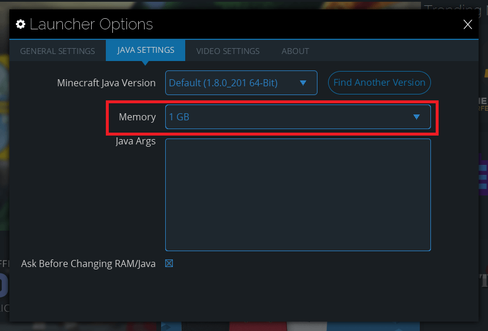
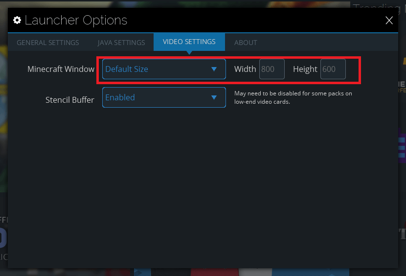
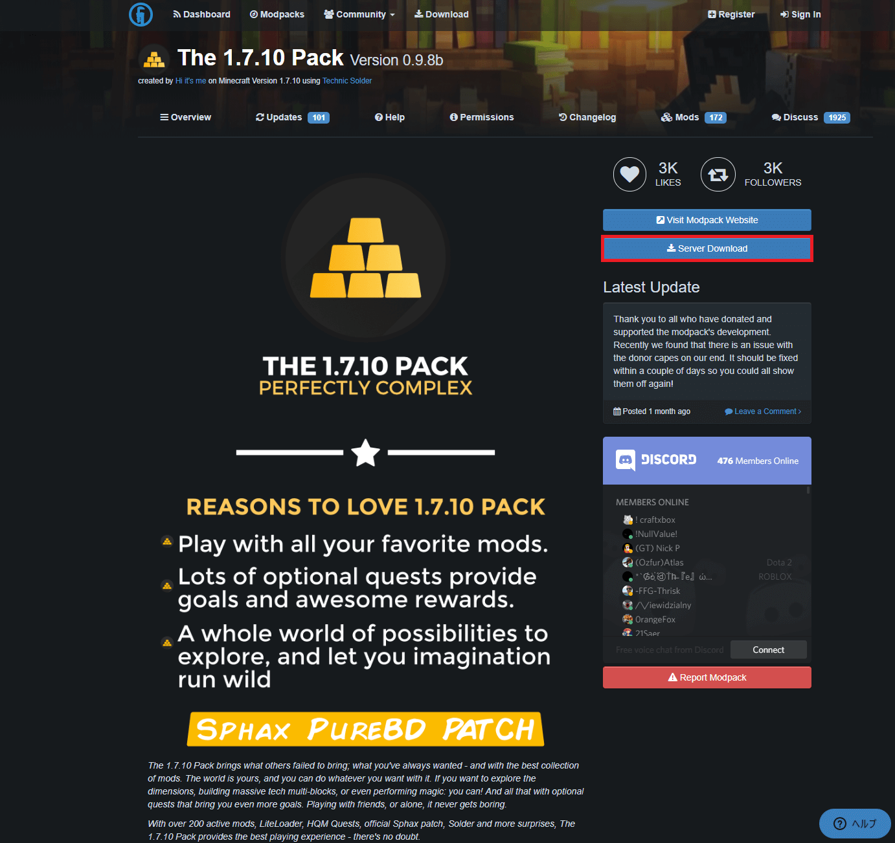

Technic Launcher はいくつかある Minecraft ランチャーの 1 つで、数ある他のランチャーと同様に MODPack で遊ぶことができます。

この記事では Technic Launcher の導入と設定方法、そしてこのランチャーで代表的な MOD Pack である「The 1.7.10 Pack」をインストールする方法をお伝えします。

無料の Minecraft レンタルサーバー「Aternos」で簡単に「The 1.7.10 Pack」のサーバー構築する記事も合わせて参考にしていただければと思います。

https://konoe.studio/how-to-use-free-minecraft-server-aternos-advanced/

## ダウンロードとインストール

まずは Technic Launcher をダウンロードするところから始めます。下記のリンクへジャンプしましょう。

https://www.technicpack.net/download

ページの下部にダウンロードボタンがあります。OS の種類別となっています。

ダウンロードしたファイルを起動します。

このような画面が表示された場合は、Java がインストールされていません。

下記の記事を参考にまずは Java をインストールしましょう。

https://konoe.studio/how-to-install-java-for-minecraft/

オススメは標準的な Standard Install ですが、データを持ち運びたい人のために Portable Mode も用意されています。どちらか選択して「Install」ボタンでインストールを開始します。

インストールが開始されるとカッコよく透過された進捗画面が表示されると思います。

インストールが完了すると、アカウントを入力する画面が表示されます。これから遊ぶ Minecraft 用 Mojang アカウントのメールアドレスとパスワードを入力します。「Remember this account」にチェックを入れておくと、次回から入力を省略できます。入力できたら「Login」ボタンでログインします。

うまくログインできれば、下記のようなトップ画面が表示されると思います。

## オプションの解説

Technic Launcher は設定項目が少ないため比較的簡単です。画面右上の「Launcher Options」からオプションに入れます。

### 基本設定

オプションを開くと最初に見えるのが、設定画面一番左のタブである「General Settings」です。

変更する意味のあまりない設定は説明しませんが、一番下の「Start in Modepaks Tab」はチェックしておくと、起動時のタブが「Discover」から「Modpacks」になるため、ゲームの起動が 1 手早くなると思います。

### Java 設定

2 番目のタブにある「Java Settings」です。ここで設定したいのはメモリの使用量。「Memory」を自分の環境に合わせて多めに設定しておきましょう。私の場合は PC にのっているメモリの半分くらいを指定します。

### ビデオ設定

3 番目のタブ「Video Settings」についてです。「Minecraft Window」の設定を変更しておくと、指定した解像度で Minecraft が立ち上がるようになります。

## MOD Pack を導入してみる

冒頭で説明した通り、この記事では「The 1.7.10 Pack」をインストールします。他の Mod Pack をインストールする方法も選択するものが違うだけで基本は同じですので、参考になると思います。

### 検索とインストール

トップ画面の上部にある「Modpacks」タブを選択し、左側の検索窓に「The 1.7.10」と入力すると、一番上に「The 1.7.10 Pack」がひっかかりました。「The 1.7.10 Pack」をクリックし、右下の「Install」ボタンでインストールを開始します。

### 起動

インストールが完了すると、「Install」だったボタンが「Play」に変わります。

「Play」を押してしばらく待つと The 1.7.10 Pack が入った Minecraft が起動します。

## その他

自分でサーバーを立てる場合のサーバー版ダウンロード方法や、MOD 一覧などを調べる方法です。

### サーバー版のダウンロード

起動直前の画面にある「About The 1.7.10 Pack」を押すことができ、押すと Web ページへ移動します。

移動先のページにある「Server Download」を押します。

自分がインストールしたバージョンに合ったサーバーパッケージをダウンロードしましょう。

### MOD 一覧の確認

これは MOD Pack 毎に違うと思いますが、基本的にサーバー版をダウンロードするのと同様の Web ページへ移動して探すことになります。

「Server Download」の上にある「Visit Modpack Website」から探して下さい。

参考までに The 1.7.10 Pack の MOD 一覧はこちらのページにありました。

https://the-1710-pack.com/mods
