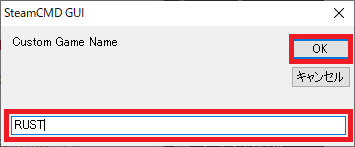

先日、SteamCMD とそのセットアップについて説明しました。

https://konoe.studio/how-to-setup-steamcmd/

しかしながら SteamCMD はコマンドラインを目的に作られているので当然ですが、コマンド操作に慣れていない人にはかなりハードルが高いです。

そんな中、SteamCMD をグラフィカルに操作するためのツールとして、SteamCMD GUI というものが有志によって作られていますので、そちらを紹介したいと思います。

## ダウンロード

開発者である Dio Joestar さんの GitHub ページへ行きます。

下部にダウンロードの URL と、そのミラーが書かれています。今回は赤枠から進めます。

最新のリリースへのリンクとなっているので、そちらから SteamCMD.GUI.zip をクリックしてダウンロードします。

ダウンロードした Zip ファイルを展開して、中にある SteamCMD GUI.exe を起動します。

## 起動と設定

起動できたら最初に「Download SteamCMD」ボタンを押して SteamCMD 本体をダウンロードします。

押すと、SteamCMD GUI を展開したフォルダに steamcmd.zip がダウンロードされたことがわかります。

展開した中身を設置します。例として、`C:\steamcmd`に置きました。

Browser ボタンを押して、先ほど設置したパス―今回の例では`C:\steamcmd`を選択します。

下記のようなエラーが下部に出ている場合は、選択したフォルダに steamcmd.exe がないということなので、ファイルを指定した場所に正しく設置できたか確認しましょう。

うまく設定できていれば、下記のような状態になってると思います。

## サーバーアプリケーションのインストール

### インストールするアプリケーションの情報

冒頭に紹介した記事と同様に、前提として二つの情報が必要で

- インストール先のフォルダパス
- インストールするアプリケーションの ID

**インストール先のフォルダパス**は、これから SteamCMD を使ってインストールするアプリケーション達をどこに保存するかを指定する、フォルダの宛先です。どこでもいいですが、SteamCMD をインストールした場所とは別の場所にすることをおすすめします。この記事では`PATH`と表現するので、各自で読み替えて下さい。画像の例では

**インストールするアプリケーションの ID**は、Steam 上で設定されている、アプリケーションに対応する ID です。この記事では`ID`と表現するので、各自で読み替えて下さい。

補足ですが、ID は下記のサイトから調べることもできます。

https://developer.valvesoftware.com/wiki/Steam_Application_IDs

サーバーに関してはこちらです。

https://developer.valvesoftware.com/wiki/Dedicated_Servers_List

とはいえ実際に存在するパスを使わないと画像が撮れないため、今回は下記を例として、RUST のサーバーをインストールします。

- `PATH` = C:\steamcmd_install
- `ID` = 258550

### インストール先の設定

今度は下段の「Browser」ボタンから、PATH を指定します。

先ほどと同様に、うまくいけばこのような状態になっているかと思います。

### インストールするアプリケーションの設定

これからインストールするサーバーアプリケーションが Valve のゲームであれば、下記のように最初から選ぶことができる中にあると思います。

今回の例である RUST のように、最初から選ぶ中にない場合は、「Add」ボタンを押して追加します。

名前と`ID`を聞かれるので、好きな名前（ここでは RUST）と`ID`を入力し、OK を押します。

さっきまでなかった RUST が追加されたことが確認できたと思います。

### インストール

RUST を選んだ状態で、「Update/Install」ボタンを押します。

下記のようなコンソール画面が動き始めていれば、うまくインストールが始まっている状態です。

途中でファイアウォールの警告が出てきた場合には、許可してあげましょう。

起動されていた SteamCMD が下記の状態で入力待ちになればインストール終了です。

## おわりに

「Run Server」というタブがあったので、てっきりインストールしたアプリケーションを何でも実行できるのかと思いましたが、そんなことはなかったです。

どうやらプリセットされていたゲームサーバーアプリケーションについてはここから簡単に設定して実行できるみたいですが、それ以外では従来通り自分でバッチなりを書く必要があるみたいです。
