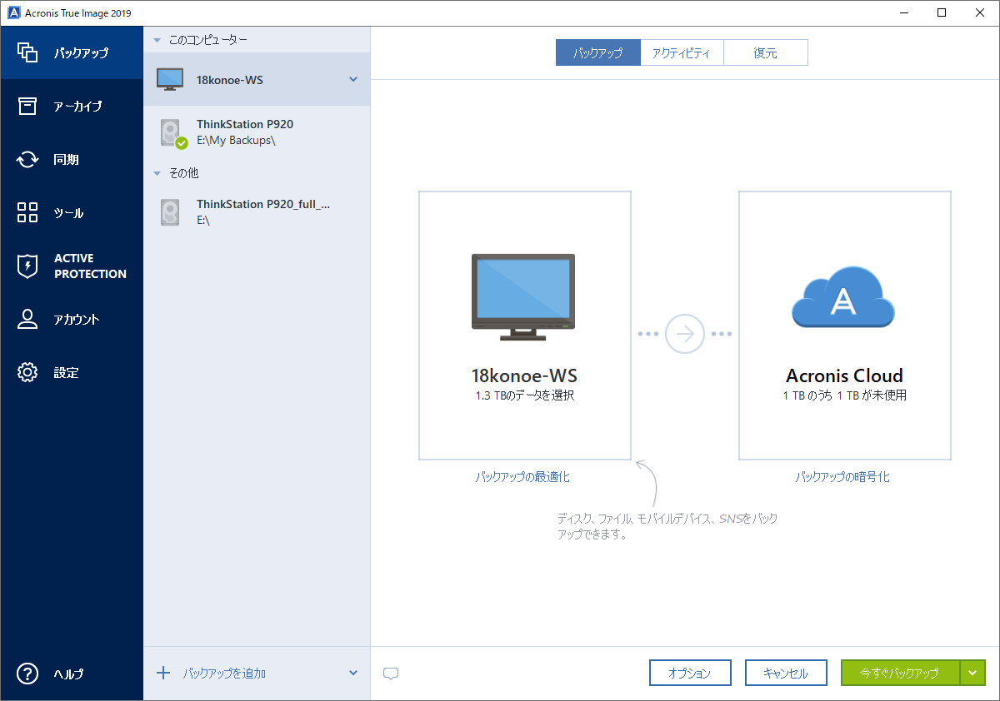
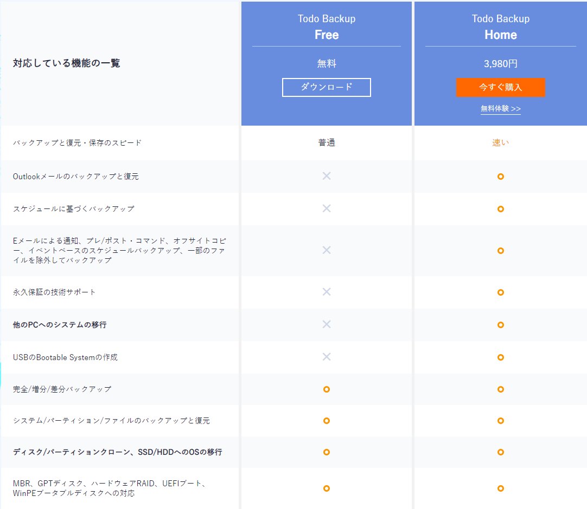
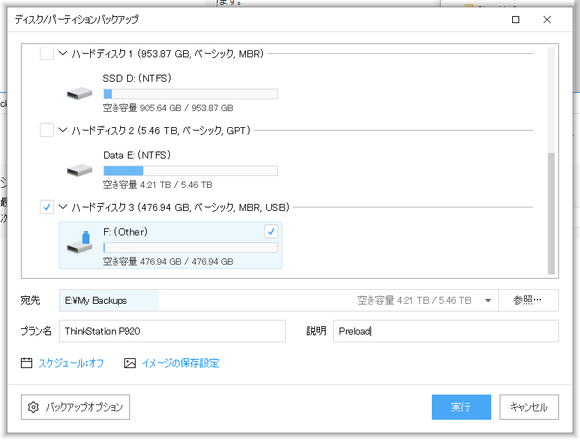
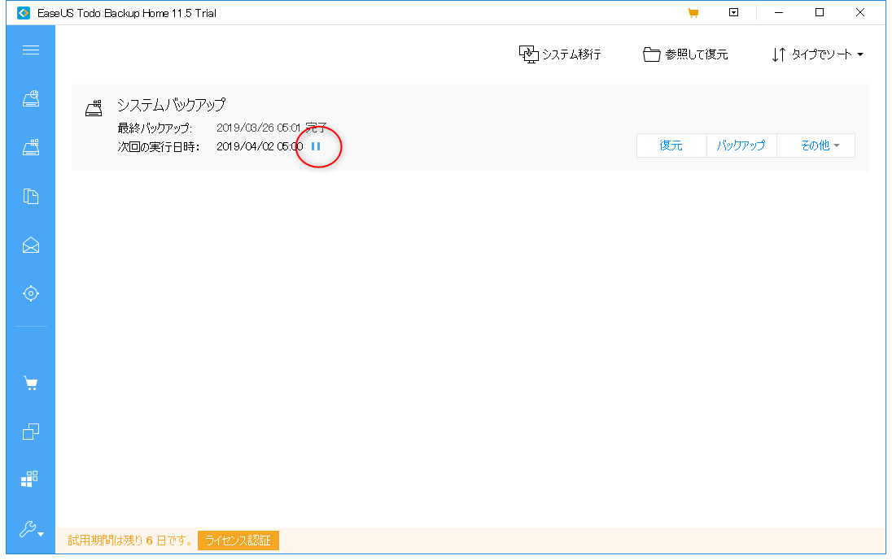
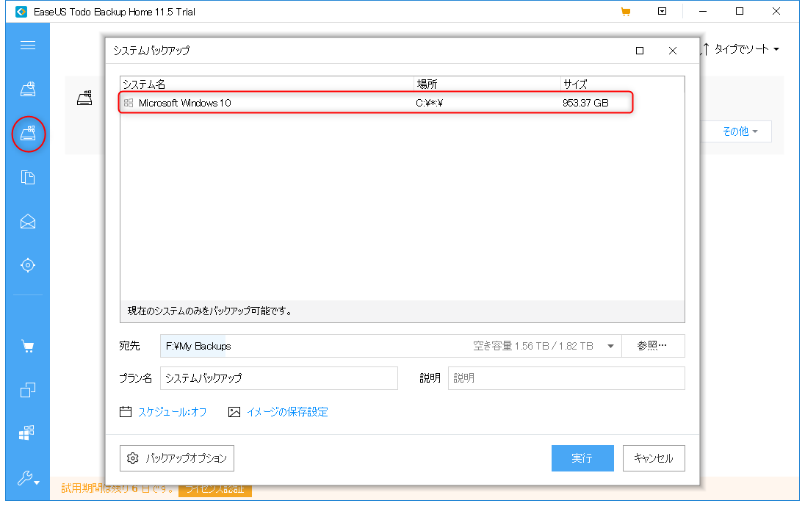
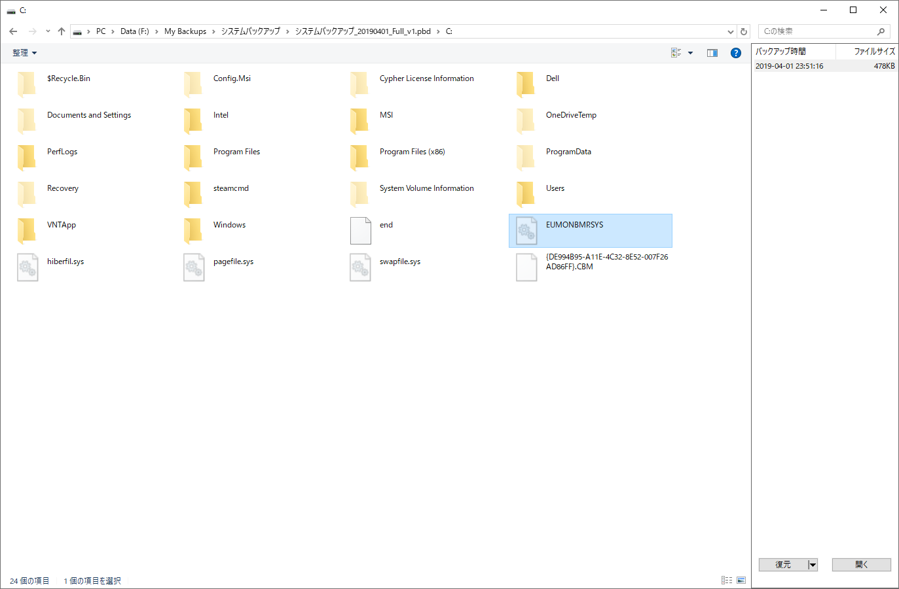
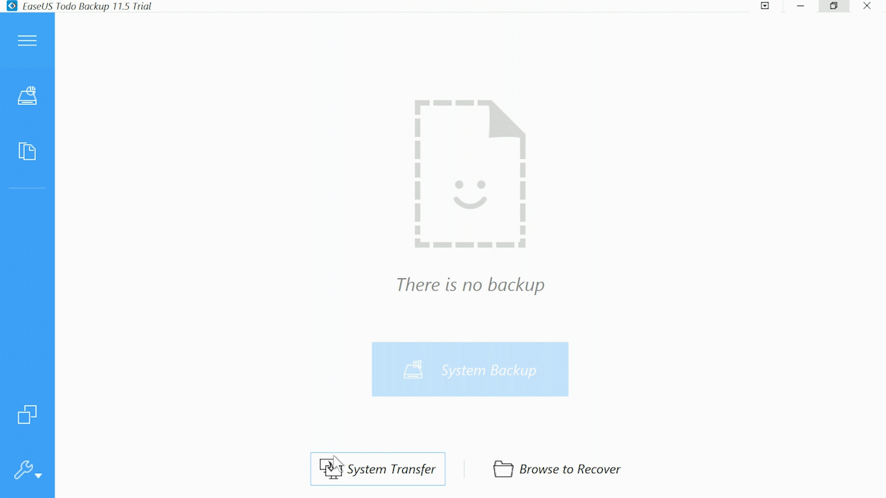
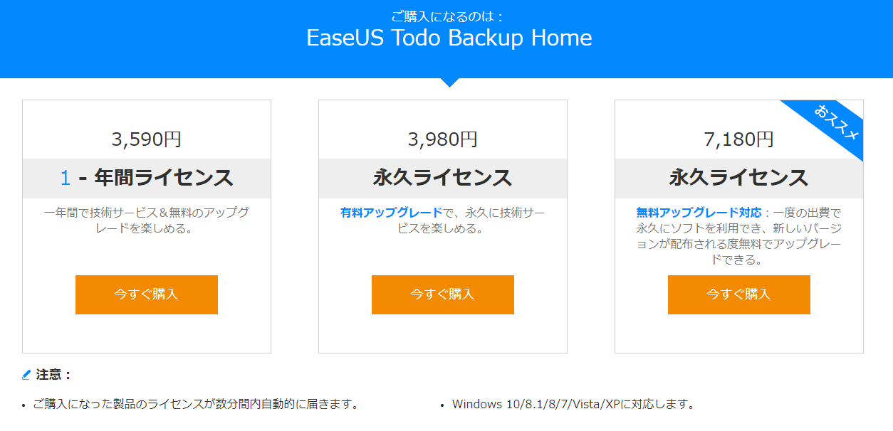

毎年 3/31 日は「世界バックアップデー」であることをご存じでしょうか？
これには「エイプリルフールのウソが現実にならないように」という願いが込められているそうです。
そのため毎年この時期になると、バックアップ用のソフトウェアがセールなどを行ったりしています。

それに併せて私も[バックアップツール](https://jp.easeus.com/backup-software/free.html)の入れ替えを検討しましたので、それについてまとめようと思います。

## 検討の動機

端的に言うと、今使っている Acronis True Image というツールの機能や販売モデルなどに疑問があるためです。

- UI が使いにくくなった
- 使わない機能が多い
- 価格に疑問を感じる

もう少し詳しくみていきましょう。

### UI が使いにくくなった

2014 年くらいからでしょうか。UI が一新され、Windows ストアアプリ風のインターフェースになりました。

しかしこれが使いにくいんです･･･まさしく退化しました。今はだいぶマシになりましたが、当時は動作も怪しかったです。

例えば、コンピューター全体のバックアップを設定すると、自動でリムーバブルディスク以外の全ドライブをバックアップする設定になります。**少なくとも私にはフレンドリーとは言えない UI でした。**

### 使わない機能が多い

差別化を図るためか、何やら色々と機能が多いです。例えば SNS のバックアップなどです。

私に必要な機能をまとめると、たったのこれだけです。

- ドライブ丸ごとバックアップ
- スケジュールで増分/差分バックアップ
- USB ブートでバックアップ/復元

他にもあれば便利だなという機能はありますが、最低限必要なものはこんなものでした。

### 価格に疑問を感じる

UI が一新した 2014 頃から、バージョン表記が「2014」のように西暦表記になりました。それから先、毎年よくわからない機能が追加されてはバージョンアップを繰り返しています。

こういうソフトウェアを買う人はよくわかると思いますが、基本的に買い切りの場合はそのメジャーバージョンのみ買い切りで、アップデートがあったら少し安くアップデート版を買えます。

また、最近では年額を払い、期間内は無料でアップデート可能なサブスクリプションモデルも一般的になってきました。

何が言いたいかというと、欲しい機能があまりないこともあり、少し割高感を感じるようになってきました。上記の機能さえ満たしていれば、もう少し安いほうが良いと考え始めたのです。

## EaseUS Todo Backup について

検討している移行先のツールは[EaseUS Todo Backup](https://jp.easeus.com/backup-software/free.html)というバックアップツールです。

有料版に比べて機能は制限されますが、Free 版も提供していることから、昨今じわじわと存在感を増している会社です。

今回はこちらの Home エディションの体験版を使ってみました。

## 機能の体験

結論からいうと、Windows 上で動作する**UI のわかりやすさ・操作性が抜群に良く、その反面 USB ブート版は動作が惜しいです。**

### UI が良い

とにかく UI のデザインが明快でわかりやすいです。いくつか例を挙げてみましょう。

#### ドライブのアイコンで USB ドライブなどがすぐわかる

地味かもしれませんが、こういうビジュアルデザインへもこだわりが感じられるのは、ソフトウェアエンジニア的にも GOOD です！

#### スケジュールの一時停止をすぐに行える

バックアップのスケジュールが機能しているかも一目瞭然です。そして止めたいときはボタンを押すだけ。

#### Windows システムを一発で選んでバックアップをスケジュールできる

ここ、Acronis のでは不満だったポイントが解消されていてすごく良いと思いました！ドライブを選ぶ面倒から解放されただけでなく、より初心者にもおすすめしやすいポイントだとも感じます。

### あると嬉しい便利な機能

上記の絶対必要な機能には挙げませんでしたが、「これあると嬉しいんだよな～」という機能があります。

#### アーカイブをダブルクリックで直接中身を見られるやつ

これ、マジで便利です。後になって「あ！あれ消したんだったわ！」っていうファイルをササッと復元できます。

絶対に必要ではないですが、あると超便利です。

### USB ブート版の動作

緊急時や C ドライブの移動などを行うときに使うのが USB ブータブルメディアです。あらかじめ作っておくことで、何かあった際も安心です。

まず申し上げておかなければならないことは、USB ブートで起動する WinRE（PE?）は日本語であるにも関わらず、起動するアプリケーションは英語になっています。

EaseUS Software 様に確認したところ、現在英語のみをサポートしているとのことです。私にとっては問題ありませんでしたが、日本語のサポートが必須とお考えの方は留意するべきポイントかと思われます。

今後のアップデートでこちらも日本語対応すると、初心者の方にもおすすめしやすくなると考えています。

ちょっと気になったのは、SATA にインストールされていた PC のプリロードイメージを NVMe に引っ越しさせた時です。これを行うと普通はそのまま起動しなくなるため、かなり特殊なケースですが、Acronis の場合は起動できないものの、Windows の回復が実行可能だったため、そのまま NVMe で初期化することで動作するようになりました。

しかし EaseUS の場合は、C ドライブがアクティブにならなかったためか、回復にたどり着けませんでした。

あまりやらないケースであるため、この結果をもってして悪いとは思いませんが、今後似たようなことを行う際には慎重に計画する必要があると感じました。

通常のリストアが可能であるならば大した問題ではないでしょう。

## 価格の比較

EaseUS はお手頃な価格だと思いました。なぜかというと Acronis は 3 台・5 台でディスカウントがあるのに対して、EaseUS は**無料アップグレード対応の永久ライセンス**という選択肢があるからです。

私の琴線に触れるこの素晴らしい販売モデルに思わず「おお･･･」と感嘆しました。

7,180 円でずっとアップグレードして使えるというのはスゴイ･･･！

- 5 台以上を継続するなら Acronis のほうが安いかもしれない
- 1 台なら EaseUS で永久アップグレードするのが安い

ほとんどの一般ユーザーは 1 台なので、家庭用に対するアプローチは EaseUS が有利に思えます。

## 総評

私の評価ですが、必要な機能のみに重視し、価格もお手頃な EaseUS Todo Backup は想像以上に良かったです。

使いやすさや価格は申し分なく良いです！あとは USB ブータブルにさえ力を入れて安心できるようになればほぼ死角ナシだと思います！

気になった方は是非、[体験版](https://jp.easeus.com/backup-software/free.html)を使ってみてください。
