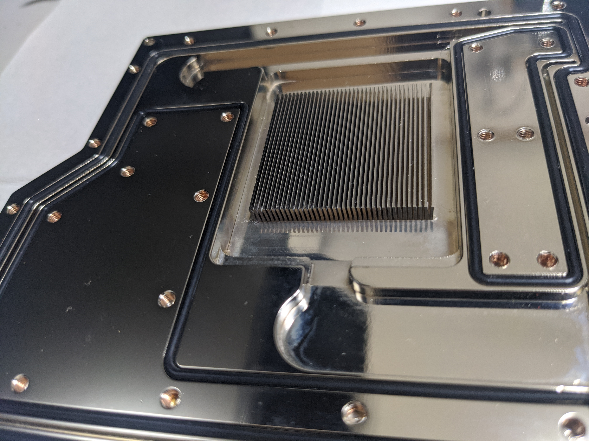
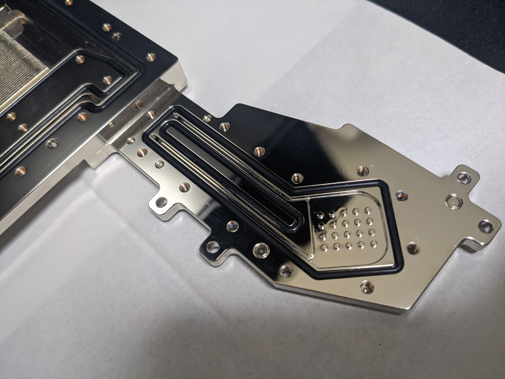

2019 年の 10 月頃、ASRock は世界 999 台限定をうたう X570 チップセット搭載の水冷専用マザーボード・X570 AQUA を発売しました。私はこれを機に、数年ぶりとなる本格水冷 PC を組もうと決意し購入したものの、最終的には 1 年足らずで売却。別のマザーボードを購入し、そちらで 3 回目の水冷 PC を組むことにしてしまいました。

約 10 万円の超弩級マザーボードであることは間違いありませんでしたが、この記事を通して X570 AQUA、ひいては水冷専用マザーボードについての感想を述べたいと思います。ついでに水枕の分解清掃時に撮った内部の写真も掲載します。

## 購入の動機

X570 チップセットにファンが装着されるのを見て、nForce チップセットの悪夢再来と感じたのは私だけではないはずです。そんな中で CPU とチップセットの両方を水冷できる AQUA は魅力的に映りました。

前者ほど惹かれたわけではありませんでしたが、もう一点は 10GbE のチップを搭載していたことです。自宅では 10GbE で NAS と接続する環境があるため、そのために追加の NIC を搭載する必要がないのはメリットでした。X570 でそのまま 10GbE が使えるマザーボードはほとんどないか、或いは存在していないと思います。

## 何が気に入らなかったか

X570 の良い点は他のブログにて山ほど解説されていると思いますし、それも概ね同意できるものであるため、この記事ではとにかく気に入らなかった点を挙げていきます。

### 動作確認に水冷環境が必要

これは AQUA に限らず、今後現れるであろう水冷専用マザーボードについて回る宿命ではないでしょうか。CPU だけならともかく、チップセットも水枕がついているために、CPU とマザーボードの動作テストをするためだけにも水路が必要でした。これはクイックディスコネクトとソフトチューブなどを駆使できるような、水冷部品に余裕のある状態であれば、ある程度楽になると思います。一方で、完成状態に必要な部品しか所持していない状態ではかなり大変です。

### TPM ヘッダがない

自作 PC 界隈において、なぜか私以外に TPM ヘッダの有無を気にする人を見たことがないため、共感は得られないかもしれません。

ASRock のマザーボードはこれまでほとんどのモデルで TPM ヘッダを搭載していました。ですが残念なことに AQUA は 10 万円もするのについていません。仕方なく CPU の fTPM を利用して BitLocker を有効にしました。

しかし fTPM は BIOS アップデートで初期化されてしまうため、新しい CPU 最適化を求めて BIOS アップデートを行うと、起動時に泣きながら複合化キーを手動入力する羽目になります。

### 水枕の構造が複雑

分解清掃した後の写真を見るとよくわかります。チップセットに回る水路と VRM 用の水路が極端に細いため、この部分が詰まると分解清掃の他に道はありません。かといって普段から詰まることのないよう警戒しておくのは疲れます。

写真はブログにギャラリーが実装できるまで、最後にまとめて載せておきます。

## ならどうするか

結局、「空冷マザー＋専用水枕」で良いじゃんという話になります。EK WaterBlocks などの水冷メーカーで、VRM ごと冷やす Mono block と、チップセット用の水枕がある製品を選ぶことにします。

X570 では GIGABYTE の AUROS シリーズが該当します。

## おわりに

昨今の CPU 消費電力は上がる一方であるため、水冷専用マザーボードはこれからも登場すると思います。この記事に書いてあることが一つでも参考になれば幸いです。

## 分解清掃後の写真

