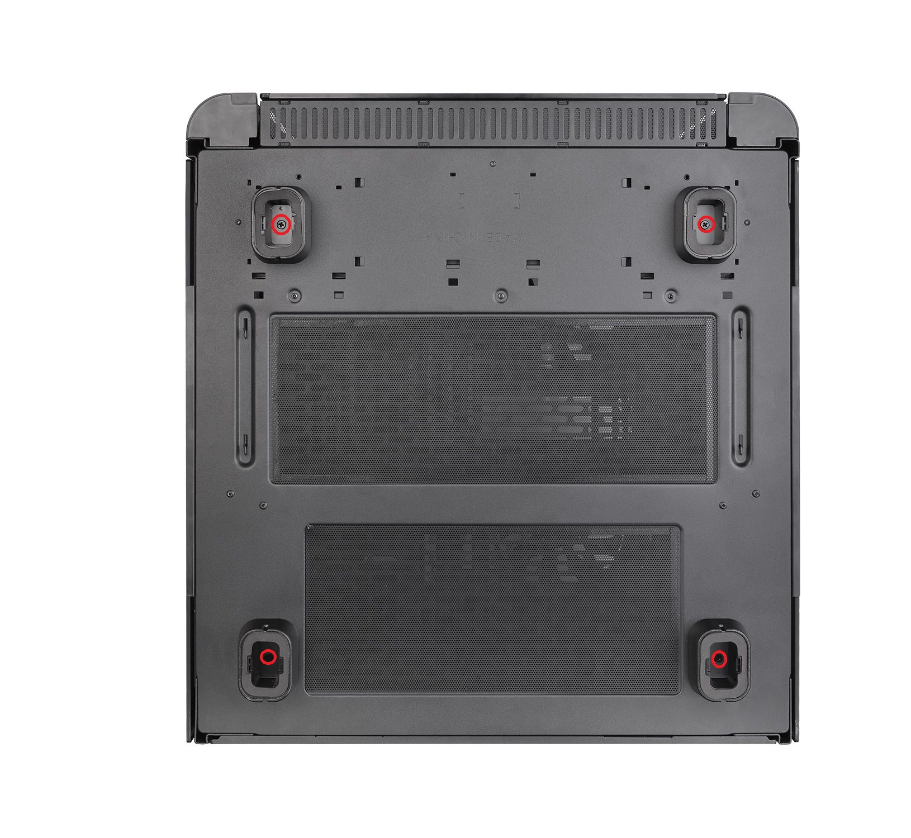

2019 年、AMD は Zen2 プロセッサの登場と同時期に私は本格水冷を再開しました。CPU のプロセスルール微細化が進まない中でも競争のために性能向上を強いられた結果、自作 PC における TDP は全く意味のない数値となるほど消費電力は増大したという背景があります。

そして 2020 年、（私の中での）自作 PC は大艦巨砲主義に回顧する流れとなり、大型ラジエター 2 台を積んでなお余裕のあるスペースが欲しかったことから、Thermaltake LEVEL 20 HT を購入するに至りました。

## 大型ケースの問題点

購入を決意するのはよかったものの、私には一つ懸念がありました。それは**このケースを台車に載せると、デスクの下に入らないのではないか**というものです。掃除やメンテナンスのしやすさを重視し、このような平台車の上に載せた状態でデスクの下に滑り込ませて運用していました。

LEVEL 20 HT の寸法は`H613 x W468 x D503 mm`です。日本の一般的なデスクの高さは`700mm`。うちのデスクは板の下に柱もあり、下の空間は約`635mm`でした。

縦横`500mm`ある平台車の厚みは`80mm`くらいあります。どう考えても台車に載せながらデスクの下には配置できません。

そこで、LEVEL 20 HT の足を取り外し、代わりにキャスターを取り付けることにしました。

## 足の取り外し

底面の写真からわかるように、足はネジで固定されています。赤丸の 4 か所を外すだけですので簡単です。

## キャスター取り付け寸法

足を取り外すと、いかにもキャスターを取り付けられそうな穴が見えるので、その寸法を測ります。（正確な値ではないので参考までに）

## キャスターと固定用ねじ選定

取付ピッチが`25mm×25mm`・取付穴径`4~5mm`くらいのキャスターなら（若干のゴリ押しを含めて）取り付け可能でした。
ネジは高さ 10mm あれば十分です。穴径`4mm`のキャスターなら`M4`、`5mm`なら`M5`でいいと思います。
キャスターの車輪径は`40mm`と`50mm`がありましたが、許容荷重と、取り付け後の高さに影響します。

私はこちらの車輪径が`40mm`のキャスターを M4 ネジで取り付けました。ピッタリではなかったですが、M4 ネジで取り付けできました。

<a href="https://www.amazon.co.jp/NZCMYX-%25E3%2583%2596%25E3%2583%25AC%25E3%2583%25BC%25E3%2582%25AD%25E4%25BB%2598%25E3%2581%258D%25E3%2583%2595%25E3%2583%25A9%25E3%2583%2583%25E3%2583%2588%25E3%2582%25AD%25E3%2583%25A3%25E3%2582%25B9%25E3%2582%25BF%25E3%2583%25BC360%25E5%25BA%25A6%25E3%2583%25AD%25E3%2583%25BC%25E3%2582%25BF%25E3%2583%25AA%25E3%2583%25BC%25E3%2583%259F%25E3%2583%25A5%25E3%2583%25BC%25E3%2583%2588%25E3%2582%25B7%25E3%2583%25AA%25E3%2583%25BC%25E3%2582%25BADIY%25E5%25AE%25B6%25E5%2585%25B7%25E4%25BA%25A4%25E6%258F%259B%25E3%2582%25AD%25E3%2583%2583%25E3%2583%2588%25E7%259B%25B4%25E5%25BE%258440mm-%25EF%25BC%25884%25E5%2580%258B%25EF%25BC%2589/dp/B07RZB87BB" data-iframely-url="//cdn.iframe.ly/TYGNLXl?iframe=card-small&omit_script=1"></a>

## キャスターの車輪径と高さ

最初はこちらの車輪径`50mm`のキャスターを取り付けていましたが、取り付け後の高さが`640~650mm`くらいになってしまいました。

同じシリーズの車輪径`40mm`のキャスターも売っているみたいです。

## 取り付け後の雰囲気

当初装着していた車輪径`50mm`のキャスター取り付け後の状態です。

ネジの長さは`10mm`で丁度良い感じでした。

## おわりに

少なくとも執筆当時には LEVEL 20 HT の情報は多くありませんでした。キャスターが取り付け可能かどうかを、購入前に公式の高解像度画像や紹介動画から血眼になって探し、到着後も寸法を測り適合しそうなキャスターを見つけるためにそれなりの時間をかけました。

このケースを検討している・あるいはすでに購入されている方に向けて、本記事が一助となれば幸いです。

