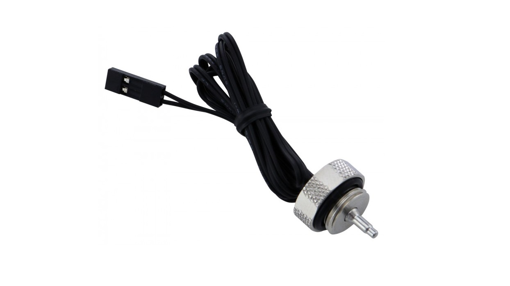
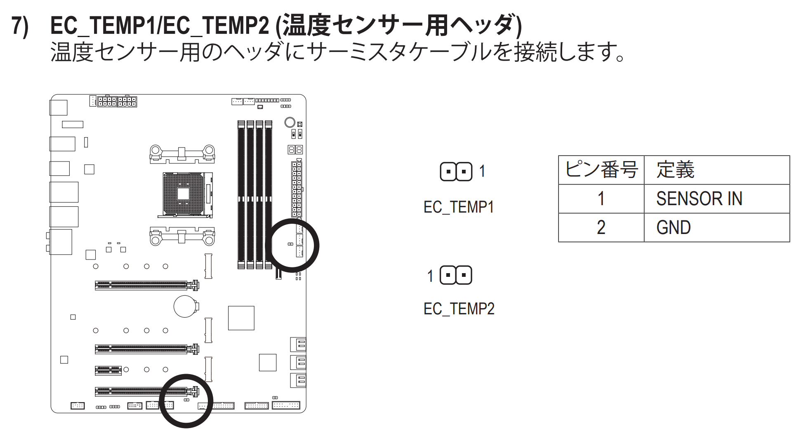
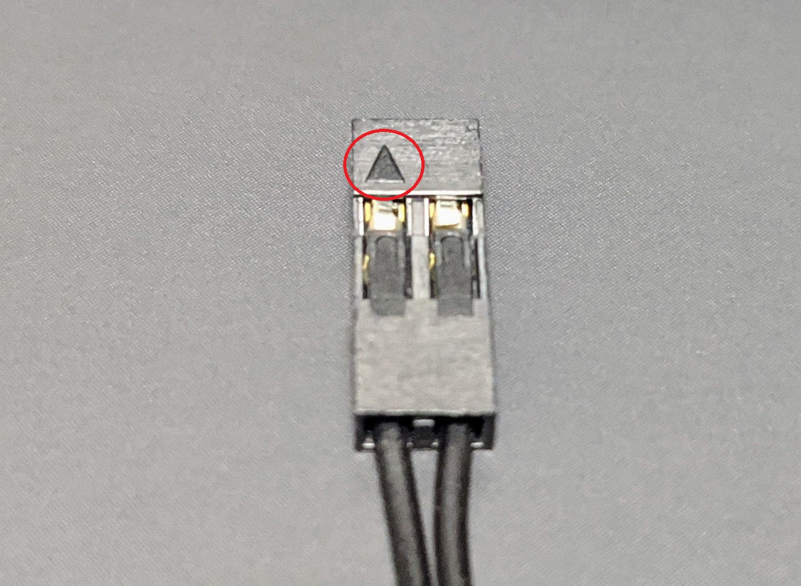

ASRock X570 AQUA を手放した代わりに、GIGABYTE X570 Aorus Master を購入しました。Aorus Master には温度センサー（サーミスタ）が付属しています。そして当然それを挿すピンも。

今回は付属品以外のサーミスタが動作するかを確認したので、その内容についてまとめたいと思います。

## 背景

私の PC は水冷環境であるため、水温系は欲しいところです。こちらの Thermaltake の水温系は持っていますが、下記のような問題があります。

- PC 上で表示できない（直接視認するしかない）
- 幅があるので場所が必要（表示のために横にする必要がある）
- 表からいい感じに見えるように配置するのが意外と大変

これを解決するために、温度計用のピンヘッダを持つマザーボードに、別途 2 ピンの水冷用サーミスタを接続できないかと考えました。

## 購入した水温計

[Koolance Coolant Temperature Sensor Plug, 10K Ohm - SEN-AP008G](https://koolance.com/coolant-temperature-sensor-plug-10k-ohm)

Description に書いてある通り、25°C で 10KΩ となるセンサーです。

> Coolant thermistor temperature sensor compatible with Koolance multi-sensor systems. Sensor fitting is G 1/4 BSPP (parallel) threaded. Wire length = 30" (76cm). NOTE: This sensor will only work with Koolance products which use 10K Ohm @25°C sensors (first introduced in 2011).

マザーボードに付属するサーミスタの詳細は不明です。同じ仕様だとわかれば簡単なのですが、わからないので温度に対する抵抗値の変化を調べ、互換可能か判断することにしました。

今回の私のユースケースにおいては、水温に応じてファンの回転数を上下させることが目的になるので、起こりうるシチュエーションに対して大体似たような抵抗値であれば良しとしたいと思います。

## 温度に対する抵抗値比較

サーミスタは温度が上がると抵抗値が下がります。ということは同じ環境において大体同じくらいの抵抗値になれば、それは大体同じ動作をする温度センサーと言えるのではないでしょうか。

手っ取り早くマザーボードを動作させられる環境があるなら、両方を接続して表示される温度を比較しても良いかもしれません。今回は水と湯につけたとき、そして部屋での抵抗値をテスターで比較しました。

|             |  付属品  | SEN-AP008G |
| :---------: | :------: | :--------: |
|     水      | 10.26 KΩ |  10.18 KΩ  |
| 部屋 (26℃)  | 9.38 KΩ  |  9.44 KΩ   |
| 湯 (約 40℃) | 5.90 KΩ  |  5.91 KΩ   |

ほぼ同じですね。抵抗特性は対数グラフのため、温度が高いときほど差が小さいのも予想通りです。
これは付属品も*だいたい 25°C で 10KΩ となるサーミスタだと判断しても良さそう*です。

## 温度計用のピンアサイン

マザーボードの説明書にピンアサインが書いてあります。

温度計側は先端に印のついている側が SENSOR IN です。見えている金属部分にテスターを当てて測定しました。

## おわりに

GIGABYTE X570 Aorus Master の付属品であるサーミスタと、Koolance の水温計の抵抗値を比較しました。様々な環境でテストしたわけではありませんが、**水温の上昇に歯止めがかかるように自動でファン回転数を調整するには十分利用できると考えられる**程度には同じような抵抗値であるとわかりました。

GIGABYTE のその他ないし今後のマザーボードで同様のサーミスタが使われるかは不明ですが、付属品以外のサーミスタを接続したい方に有用な情報となれば幸いです。
