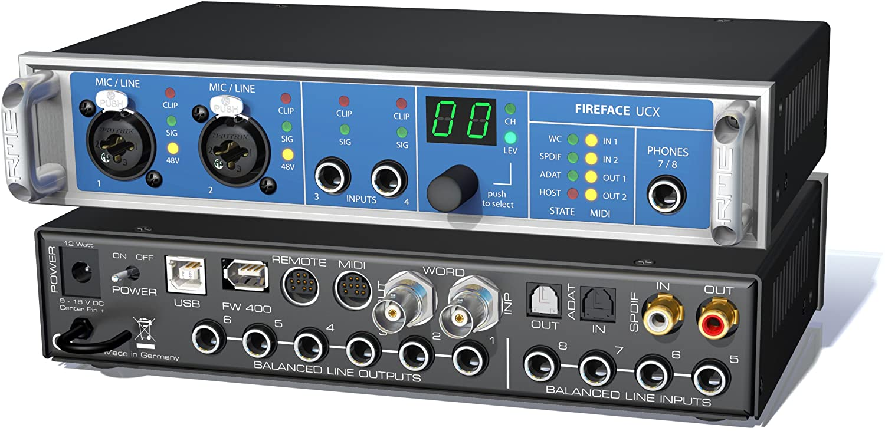

PCでのオーディオ環境のために、自分が気に入っているヘッドフォンやオーディオインターフェースを使う人は少なからずいらっしゃると思います。

私はDAWを使わないしDTMもしないのですが、こちらのFireface UCXを愛用しています。

見ての通り小型のマイク端子を挿すジャックなどありません。

私はこの環境でボイスチャットをしながらゲームもしたいと考えました。オーディオインターフェースを使っているならXLRの入力からマイクインしたいですよね。なぜならこの手の製品はマイクインした音声はほぼ遅延なしにモニターすることができます。これはゲーミングヘッドセットでサイドトーンと呼ばれる機能に近いです。

**XLRの入力からマイクインしたいけどデカいマイクを口元に配置するのはイヤ。**そういう方にむけて、まず私がボイスチャット環境のために試した方法をいくつか紹介し、最終的にModMicを勧めるのが本記事の趣旨となります。

## これまで試した方法

まずオーディオインターフェース＋ヘッドフォン環境にマイクを足すにはどのような方法があり、それが私にとってどのような問題があったのか挙げておきます。

### ヘッドセット

ヘッドセットは接続方法でだいたい3種類に分類できます。

* USB接続
* 4極ミニプラグあるいは3極+2極のミニプラグ
* Phoneプラグ+XLR入力

*ヘッドフォン自体が変わってもいいなら、スポーツ実況などの現場などに使われるPhoneプラグ+XLR入力のヘッドセットでOK*。ShureやBayerdynamic、AKGあたりの製品がありますので、それで終了となります。

でも違うんです。それでよければ悩んだりしません。実際やってみましたが、付け心地が悪くて諦めました。

USB接続は手軽に自身のオーディオインターフェースをバイパスして接続できますが、VCやゲームの度にWindows上のオーディオデバイスを切り替えるなど手間が発生しました。ショートカットキーでデフォルトオーディオデバイスを切り替えるアプリケーションも試してみましたが、どちらにせよ一手間あることには変わりありません。

ミニプラグに至っては挿す場所がないでしょう。オーディオインターフェースの基本的な入力はXLR端子ですし、プラグインパワーは使えません。

つまり**付け心地・音質・手間・接続の制約などの都合で、ヘッドセットは論外**でした。

### XLR接続のダイナミックマイク/コンデンサマイク

*XLR接続のマイクはこの問題における現実的なソリューションのひとつ*です。大型で音質もよく、ゲーム配信や実況などで使うユーザーがたくさんいるため情報も集まりやすいです。

しかし**とにかく邪魔**です。口元にマイクを配置するためのアームは手軽に購入できるようになりましたが、目の前にあるデカいマイクの圧迫感はそのままです。24インチ程度のモニターなら邪魔にならないかもしれませんが、私の42インチモニターに対しては視界を塞ぐ結果になりました。

もう一つ体験した問題は、マイクから離れると反射音などで音質が悪くなるため、**姿勢に併せてマイクの場所を調整する必要があった**ことです。椅子を後ろに倒したり、逆に近づいたりする度にマイク位置の調整が必要です。

また、**多くのXLR接続マイクはミュートするスイッチがありません**。とっさにショートカットでミュートするのは難しいため、ボイスチャットにおいて物理的なミュートスイッチの有無は重要だと私は考えます。

## ModMic Uni

ModMicは[Antlion Audio](https://antlionaudio.com/)という会社のプロダクトで、*ヘッドフォンにくっつけるタイプのマイク*です。

以前は転売品しかありませんでしたが、最近日本のAmazonでも正式に取り扱いが始まりました。

<a href="https://www.amazon.co.jp/%25E3%2582%25A2%25E3%2583%25B3%25E3%2583%2588%25E3%2583%25A9%25E3%2582%25A4%25E3%2582%25AA%25E3%2583%25B3%25E3%2582%25AA%25E3%2583%25BC%25E3%2583%2587%25E3%2582%25A3%25E3%2582%25AA-3-5mm%25E3%2583%2594%25E3%2583%25B3%25E3%2582%25B8%25E3%2583%25A3%25E3%2583%2583%25E3%2582%25AF%25E6%258E%25A5%25E7%25B6%259A-%25E3%2583%259F%25E3%2583%25A5%25E3%2583%25BC%25E3%2583%2588%25E3%2582%25B9%25E3%2582%25A4%25E3%2583%2583%25E3%2583%2581%25E4%25BB%2598-PC%25E3%2580%2581Linux%25E3%2581%25AA%25E3%2581%25A9%25E3%2581%25AB%25E5%25AF%25BE%25E5%25BF%259C-GDL-1420-JP/dp/B08CXWMQQY" data-iframely-url="//cdn.iframe.ly/ZBnv47Q?iframe=card-small&omit_script=1"></a>

### 勧める理由

この製品自体、言ってしまえばただ磁石と両面テープでくっつくだけの、ミニプラグ付きマイクです。私が最も注目したのはこちらのオプションです。

*このアダプターはXLR接続する48Vのファンタム電源を、5Vプラグインパワー付き3.5mmのミニジャックへ変換します。*このオプションは小型マイクを使いたいが、XLR接続したいというニッチな需要を満たしてくれます。

これにより、お気に入りのヘッドフォンとXLR入力しかないオーディオインターフェースを使いながらも、デバイス切り替えなどの面倒な一手間をかけることなくボイスチャットを開始することができるようになります。

また、*ModMic Uniにはミュート切り替えスイッチがある*のも嬉しいポイントです。

### 問題点と工夫

とはいえこのソリューションは完璧ではありません。例えば**マイクとヘッドフォンの線を束ねると電磁誘導によりノイズが入りやすい**です。

今のところ、オーディオインターフェースのモニター機能で自分の声を聞いている分には気になるノイズは入りませんが、NVIDIAの[ShadowPlay](https://www.nvidia.com/ja-jp/geforce/geforce-experience/shadowplay/)などの録画ツールでキャプチャした動画にはノイズが入っていたりします。

私の場合はShadowPlayに録画させるマイク入力に[RTX Voice](https://www.nvidia.com/en-us/geforce/guides/nvidia-rtx-voice-setup-guide/)を利用することで、ノイズを除去することができました。

## おわりに

私のオーディオ環境にてボイスチャットのために試したいくつかの例とその問題点を挙げ、執筆時点での私にとってのベストプラクティスとしてModMic UniとXLR Power Adapterの組み合わせを紹介しました。

当記事が皆さんのボイスチャット環境構築の一助となれば幸いです。

## Appendix

執筆時点で、日本のAmazonに正式に取り扱われている製品はModMicは3.5mmミニプラグ接続のModMic Uni、USB接続のModMic USBの2種類ですが、実はUSBドングル付属の無線接続タイプのModMic Wirelessという製品があります。

私の環境には合っていませんが、マイクのないワイヤレスヘッドフォンをボイスチャットに使用したいのならば良いソリューションかもしれません。